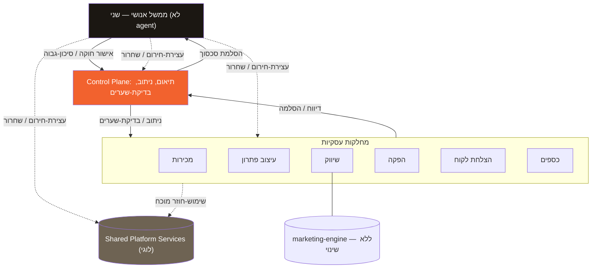
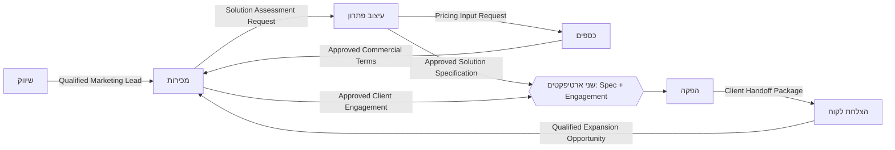
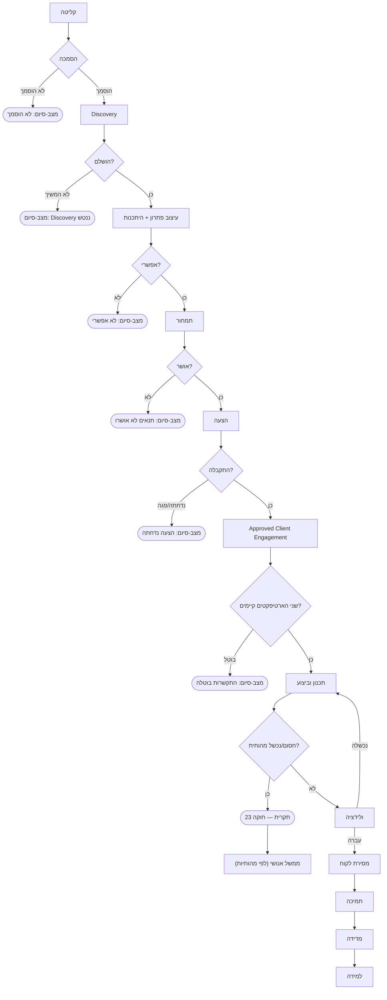
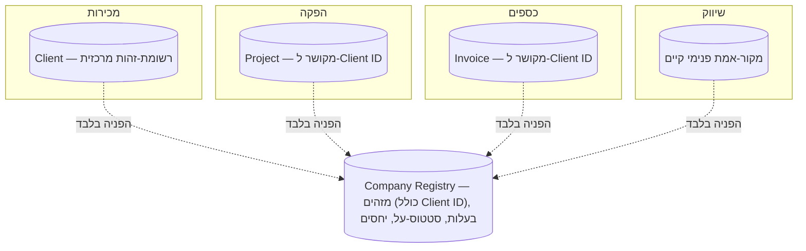

# 01-company-architecture.md — ארכיטקטורת החברה: Shani AI

> מסמך ארכיטקטורה שני בסדרה. סמכות-העל שלו היא `00-company-constitution.md` — כל סעיף במסמך
> הזה שסותר את החוקה בטל מולה. מסמך תכנון בלבד: **אין סוכנים, אין קוד, אין סכימות, אין
> workflows, אין ריפקטור ל-marketing-engine הקיים.** marketing-engine ממשיך לפעול במיקומו
> הנוכחי, ללא שינוי, כתת-מערכת פנימית של מחלקת השיווק.

## תיוגים (עקביים עם `00-company-constitution.md`)

- **[אילוץ חוקתי]** — נובע ישירות מכלל ב-`00-company-constitution.md`, מצוטט עם מספר סעיף.
- **[החלטה נוכחית]** — הכרעה מבנית שהתקבלה בקובץ זה.
- **[החלטה נדחית]** — טרם הוכרע.
- **[לא-מטרה]** — במכוון מחוץ לתחום המסמך.

---

## 0. מבנה-העל בקצרה

חמש שכבות: ממשל אנושי (שני) → Company Control Plane (תיאום, לא סמכות) → Shared Platform
Services (יכולות-תשתית, נבנות רק לפי שימוש-חוזר מוכח) → מחלקות עסקיות (שש, בעלות-נתונים
עצמאית) → מערכות ספציפיות-למחלקה (למשל marketing-engine). זו אותה חמישיית-שכבות שהוגדרה
ב-`00-company-constitution.md` §4 — המסמך הזה ממלא אותה בתוכן קונקרטי, לא מגדיר אותה מחדש.

---

## 1. ממשל אנושי (Human Governance)

**[אילוץ חוקתי]** שני היא הסמכות הסופית בחברה (חוקה §3). ממשל אנושי אינו מיוצג כ-agent —
זו שכבה אנושית טהורה, לא רכיב-מערכת.

| תחום אחריות | מקור חוקתי |
|---|---|
| כיוון החברה (אסטרטגיה, תעדוף מחלקות/מוצרים) | חוקה §2 |
| אישור/תיקון החוקה עצמה | חוקה §24 |
| אישורי-סיכון-גבוה ופעולות בלתי-הפיכות | חוקה §8, §9 |
| האצלה וביטול הרשאות | חוקה §20 |
| הפעלה ושחרור של עצירת-חירום | חוקה §16 |
| הכרעה סופית בסכסוך שסדר-הקדימות לא פתר | חוקה §5 |
| אישור מחלקה חדשה או agent חדש | חוקה §26, §27 |

**[החלטה נדחית]** האצלת סמכות-אישור חלקית לאדם נוסף מלבד שני נותרת פתוחה (חוקה §3).

---

## 2. Company Control Plane

**[אילוץ חוקתי]** Control Plane הוא שכבת-תיאום, לא מחלקה ולא agent יחיד (חוקה §22).

### אחראי ל

- החלטה לאן לנתב עבודה, לפי מדיניות מאושרת
- תיאום התקדמות עבודה חוצת-מחלקה
- בדיקה שהשערים הנדרשים התקיימו (למשל שני הארטיפקטים הנדרשים לפני הפקה, ר' סעיף 5.4, 9)
- הסלמת כשלים וסכסוכים שלא נפתרו
- צפייה בסטטוס ברמה-גבוהה

### אסור לו בהחלט (חוקה §22)

- להיות agent יחיד בלתי-מוגבל
- להיות בעל הנתונים של מחלקה כלשהי
- לכתוב ישירות למצב-מחלקה בלי ממשק מאושר
- להעניק לעצמו הרשאות
- לאשר עצמאית פעולות בסיכון-גבוה
- להחליף את הממשל האנושי
- להיות מקור-האמת היחיד של החברה

**חשוב:** Control Plane בודק שארטיפקט קיים — הוא אינו בעלים ואינו יוצר אף אחד מהם.

**[החלטה נוכחית]** תיאום, אכיפת-אישורים, תזמון, וניטור רשאים להיות רכיבים נפרדים
בעלי-הרשאות-עצמאיות (חוקה §22). המימוש הטכני הקונקרטי נשאר [החלטה נדחית].

---

## 3. Shared Platform Services

**[אילוץ חוקתי]** שירות עובר לשכבה הזו רק כשקיים צרכן שני אמיתי (חוקה §25). אף אחת
מהיכולות הבאות אינה מחולצת בפועל במסגרת מסמך זה.

| יכולת לוגית | תפקיד |
|---|---|
| אחסון ומסירת בקשות-אישור | תור-בקשות, מסלול-הסלמה (חוקה §6, §8) |
| תעבורת אירועים | תשתית-הודעות בין מחלקות |
| תשתית-תמיכה להרצת workflow | הרצת רצף שה-Control Plane קובע |
| ניהול זהות והרשאות | מי מורשה למה (חוקה §20) |
| רישום-ביקורת | audit trail (חוקה §14) |
| גישה לרשומת-הפניות | ר' סעיף 7 |
| מעקב עלות ומשאבים | תצפית תקציב (חוקה §19) |
| תמיכה בתקריות ובעצירת-חירום | תמיכה טכנית לחוקה §16, §23 — ר' סעיף 4 |
| גישה לידע ומדיניות | קריאה-בלבד — ר' סעיף 6 |
| רשומת-יכולות-כלים | הכללה של דפוס `config/tools.md` הקיים ב-marketing-engine |
| תשתית ולידציה | תומכת בחוקה §13 |
| תמיכת גיבוי ושחזור | חוקה §21 |

### אסור בהחלט ש-Shared Platform Services יכריעו עצמאית

- בעלות עסקית
- עדיפות עבודה
- תוצאות-אישור
- האם מותר לדלג על שער נדרש
- איזו מדיניות-מחלקתית גוברת על אחרת

Control Plane רשאי להשתמש בשירותי Shared Platform Services, אך אף שכבה אינה תחליף לממשל
האנושי או לבעלות-מחלקה. Control Plane מחליט; Shared Platform Services מבצעות תשתית בלבד.

**[לא-מטרה]** המסמך אינו קובע טכנולוגיית-מימוש לאף יכולת.

**עקרון הרשאה-מינימלית. [אילוץ חוקתי]** גישה ל-Shared Platform Services, ל-Registry
(סעיף 7), לידע ולאנליטיקה (סעיף 6), ולממשקים בין-מחלקתיים (סעיף 8) חייבת לפעול לפי
הרשאה-מינימלית (חוקה §17, §20). אסור בהחלט להסיק הרשאה רחבה יותר רק משום השתתפות בזרימה
חוצת-מחלקה.

---

## 4. עצירת חירום — פירוש תפעולי לשכבות

**[אילוץ חוקתי]** חוקה §16 מגדירה עצירת-חירום ברמת-חברה. הסעיף מפרש איך היא פועלת דרך
השכבות, בלי לקבוע מימוש טכני.

בזמן עצירת-חירום פעילה:

- Control Plane מפסיק לנתב עבודה חדשה משנת-מצב
- מחלקות מפסיקות פעולות אוטונומיות חיצוניות ופעולות משנות-מצב
- Shared Platform Services חוסמות/משהות נתיבי-ביצוע מושפעים
- חקירה read-only רשאית להמשיך
- עבודת-שחזור שאושרה במפורש רשאית להמשיך
- אסור בהחלט לחזור לפעילות רגילה בלי החלטה מפורשת ומתועדת של שני

---

## 5. מחלקות עסקיות — מבנה ראשוני

**[החלטה נוכחית]** מבנה שש-המחלקות (חוקה §26 — מחלקה נוספת דורשת אישור שני):

1. מכירות וקליטת לקוחות
2. עיצוב פתרון ומוצר
3. שיווק
4. הפקה ותפעול
5. הצלחת לקוח
6. כספים ומינהלה

אין הגדרת agent בתוך אף מחלקה.

### 5.1 מכירות וקליטת לקוחות

| שדה | תוכן |
|---|---|
| ייעוד | להפוך עניין ראשוני ללקוח מוסמך ולעסקה מאושרת; בעלים של רשומת-הזהות המרכזית של הלקוח |
| אחריות | קליטת פניות, צורך עסקי, הסמכה, שיחה מסחרית, בקשת הצעת-מחיר, ניהול רשומת Client |
| אי-אחריות מפורשת | אסור בהחלט לעצב פתרון טכני סופי או לאשר עצמאית התחייבות-הפקה |
| בעלות-נתונים | Client · Lead · Client Inquiry · Qualification · Business Need · Sales Opportunity · Proposal Request · Commercial Conversation · Proposal · Approved Client Engagement |
| קלטים עיקריים | פנייה נכנסת, Qualified Marketing Lead, Qualified Expansion Opportunity, Approved Commercial Terms (קלט בלבד) |
| פלטים עיקריים | Solution Assessment Request, Approved Client Engagement |
| מחלקות בקשר | עיצוב-פתרון, כספים, שיווק, הפקה, הצלחת-לקוח |
| גבולות אישור | Approved Client Engagement נוצר רק אחרי Approved Commercial Terms מכספים + הסכמת-לקוח |
| דוגמאות work objects | LEAD-*, CLIENT-*, OPP-SALES-*, PROPOSAL-*, ENGAGEMENT-* |
| כשל/הסלמה | פנייה שלא הוסמכה → מצב-סיום שגרתי; סכסוך מסחרי שלא נפתר → הסלמה לפי סיווג-סיכון (חוקה §8) |

**[החלטה נוכחית] רשומת Client — בעלים יחיד: מכירות.** מכילה רק: Client ID יציב, זהות/שם
עסקי, פרטי-קשר מאושרים, סטטוס-קשר מסחרי ברמה-גבוהה, הפניות לרשומות שבבעלות מחלקות אחרות.

מחלקות אחרות מתייחסות ל-Client דרך Client ID ואינן מחזיקות רשומה סמכותית כפולה: הצלחת-לקוח
בעלת Onboarding/Support Request/Adoption Issue/Feedback/Satisfaction Signal/Renewal
Opportunity/Expansion Request, מקושרים ל-Client ID. כספים בעלת חשבוניות/תשלומים/הוצאות
המקושרים ל-Client ID. הפקה בעלת פרויקטים המקושרים ל-Client ID. Company Registry רשאי
לאנדקס Client ID + הפניית-בעלות בלבד — אסור בהחלט שישכפל את הרשומה המלאה (ר' סעיף 7).

### 5.2 עיצוב פתרון ומוצר

| שדה | תוכן |
|---|---|
| ייעוד | לתרגם צורך עסקי מוסמך למפרט פתרון בר-ביצוע, מאושר טכנית |
| אחריות | Discovery, דרישות, הערכת-פתרון, מפרט, היתכנות, היקף, קריטריוני-קבלה, ארכיטקטורה, ביקורת-טכנית |
| אי-אחריות מפורשת | אסור בהחלט להבטיח מחיר או תאריך-אספקה מסחרי |
| בעלות-נתונים | Discovery · Requirements · Solution Assessment · Specification · Feasibility · Scope · Acceptance Criteria · Architecture Proposal · Approved Solution Specification |
| קלטים עיקריים | Solution Assessment Request ממכירות |
| פלטים עיקריים | Pricing Input Request (מידע-תמיכה), Approved Solution Specification (להפקה) |
| מחלקות בקשר | מכירות, כספים (ייעוץ בלבד), הפקה |
| גבולות אישור | Approved Solution Specification נשלמת ומאושרת טכנית לבדה, לאחר Discovery/היתכנות/היקף/דרישות/ארכיטקטורה/קריטריוני-קבלה/ביקורת-טכנית. **אינה תלויה בקבלת Approved Commercial Terms** — שער מסחרי נפרד (ר' 5.4, 9) |
| דוגמאות work objects | SPEC-*, FEASIBILITY-*, SCOPE-* |
| כשל/הסלמה | פתרון לא-אפשרי/דרישה סותרת → מצב-סיום שגרתי או לולאת-תיקון ל-Discovery, לא הסלמה אוטומטית |

**[החלטה נוכחית]** Business Need (מכירות) מתעד את הצורך כפי שהלקוח ניסח; Requirements
(עיצוב-פתרון) נגזרות ממנו דרך Discovery — אינן דורסות אותו; שני האובייקטים מתקיימים
במקביל. Acceptance Criteria (עיצוב-פתרון) מגדירים הצלחה; Quality Gate (הפקה, 5.4) מוודא
מימוש מולם, בירושה מתוך Approved Solution Specification.

### 5.3 שיווק

| שדה | תוכן |
|---|---|
| ייעוד | לבנות סמכות, קהל, ותוכן שמייצר Leads מוסמכים, לפי content-strategy.md הקיים |
| אחריות | הזדמנויות-תוכן, קמפיינים, חבילות-תוכן, תוכניות-הפצה, אסטרטגיית מותג |
| אי-אחריות מפורשת | אסור בהחלט להיות מקור-האמת ללקוחות, פרויקטים, חשבוניות, או רשומת-כלים כלל-חברתית |
| בעלות-נתונים | content opportunities · campaigns · content packages · distribution plans · brand/audience strategy |
| קלטים עיקריים | מדיניות-מותג מאושרת, הצעות (ידע-עזר בלבד) |
| פלטים עיקריים | Qualified Marketing Lead / Campaign Signal |
| מחלקות בקשר | מכירות בלבד |
| גבולות אישור | פרסום בפועל = פעולה בלתי-הפיכה (חוקה §9) → תמיד אישור אנושי |
| דוגמאות work objects | OPP-YYYYMMDD-N, PKG-YYYYMMDD-slug — קיימים בפועל |
| כשל/הסלמה | לפי המנגנון הקיים במסמכי marketing-engine — לא משתנה |

**[אילוץ חוקתי / החלטה נוכחית]** marketing-engine הוא תת-מערכת פנימית וקיימת של מחלקת
השיווק. אינו מוזז, אינו משנה שם. מקור-האמת הפנימי שלו נשאר פנימי — לא מוחלף על ידי Company
Registry (סעיף 7; עקבי עם חוקה §11).

### 5.4 הפקה ותפעול

| שדה | תוכן |
|---|---|
| ייעוד | לבצע פתרון מאושר ולשמור יציבות תפעולית |
| אחריות | תכנון-עבודה, ביצוע, בקרת-איכות, שחרור, פריסה, תחזוקה, תקריות-תפעול |
| אי-אחריות מפורשת | אסור בהחלט לשנות עצמאית היקף מסחרי או תמחור |
| בעלות-נתונים | Project · Work Plan · Task · Deliverable · Quality Gate · Release · Deployment · Maintenance Activity · Operational Incident · Client Handoff Package |
| קלטים עיקריים | **שני ארטיפקטים נפרדים ונדרשים יחד**: Approved Solution Specification (טכני) + Approved Client Engagement (מסחרי). היעדר אחד = אין ביצוע |
| פלטים עיקריים | Client Handoff Package |
| מחלקות בקשר | מכירות, עיצוב-פתרון, הצלחת-לקוח |
| גבולות אישור | Control Plane רשאי לוודא ששני הארטיפקטים קיימים — אינו יוצר/מאשר אף אחד. שינוי-היקף = סיכון בינוני+ → חוזר למכירות/כספים |
| דוגמאות work objects | PROJ-*, TASK-*, RELEASE-*, INC-OPS-* |
| כשל/הסלמה | כשל מהותי → רצף חוקה §23; דיווח לשני רק אם מהותי לפי אותו רצף, לא אוטומטית |

### 5.5 הצלחת לקוח

| שדה | תוכן |
|---|---|
| ייעוד | לשמר ולהצמיח יחסי-לקוח קיימים, מקושרת ל-Client ID שבבעלות מכירות |
| אחריות | onboarding, פניות-תמיכה, פידבק, אימוץ, חידוש והרחבה |
| אי-אחריות מפורשת | אסור בהחלט לשנות פתרון טכני/הסכם מסחרי/רשומות כספיות; אסור בהחלט רשומת-Client סמכותית משלה |
| בעלות-נתונים | Onboarding · Support Request · Feedback · Satisfaction Signal · Adoption Issue · Renewal Opportunity · Expansion Request |
| קלטים עיקריים | Client Handoff Package (בבעלות הפקה עד למסירה) |
| פלטים עיקריים | Qualified Expansion Opportunity |
| מחלקות בקשר | הפקה, מכירות |
| גבולות אישור | הרחבה/חידוש עוברים דרך מכירות+כספים כרגיל |
| דוגמאות work objects | CS-CASE-*, RENEWAL-*, EXPANSION-* |
| כשל/הסלמה | בעיה חוזרת/מהותית → הפקה (טכני) או מכירות (מסחרי), לא נפתרת חד-צדדית |

### 5.6 כספים ומינהלה

| שדה | תוכן |
|---|---|
| ייעוד | לקבוע ולשמור שלמות מידע פיננסי ומדיניות מסחרית |
| אחריות | מדיניות-תמחור, אומדני-עלות, Approved Commercial Terms, חשבוניות, תשלומים, הוצאות, תקציב, תחזית |
| אי-אחריות מפורשת | אסור בהחלט לעצב פתרונות טכניים או לשנות ישירות מצב-הפקה |
| בעלות-נתונים | Pricing Policy · Cost Estimate · Approved Price · Approved Commercial Terms · Invoice · Payment Status · Expense · Budget · Financial Forecast |
| קלטים עיקריים | Pricing Input Request (מידע-תמיכה בלבד) |
| פלטים עיקריים | Approved Commercial Terms — למכירות, קלט-בלבד; מכירות אינה כותבת-מחדש |
| מחלקות בקשר | עיצוב-פתרון, מכירות |
| גבולות אישור | אישור-מחיר מעל סף = סיכון-גבוה (חוקה §8) → שני |
| דוגמאות work objects | PRICE-*, TERMS-*, INVOICE-*, BUDGET-* |
| כשל/הסלמה | חוסר-עקביות פיננסי/חריגת-תקציב מהותית → תקרית (חוקה §23), לא תיקון שקט |

**[החלטה נוכחית]** שם-האובייקט הרשמי היחיד הוא **Approved Commercial Terms**. השם הקודם
בוטל ואינו בשימוש. כספים הן הבעלים הבלעדי; מכירות משתמשות בו כקלט בלבד.

---

## 6. ידע ואנליטיקה — יכולות כלל-חברתיות, לא מחלקות

**[החלטה נוכחית]** ידע ואנליטיקה הן יכולות חוצות-חברה (תחת Shared Platform Services, סעיף
3), לא מחלקות עצמאיות.

### ידע

**[אילוץ חוקתי]** ידע אינו זיכרון אוניברסלי בלתי-מבוקר:

- פריט-ידע חדש חייב לזהות מקור, תחום-בעלות מקורי, סטטוס-אישור, ותאריך/גרסה
- מחלקה אסור בהחלט שתפרסם בשקט לקח תפעולי כמדיניות כלל-חברתית
- ידע חוצה-מחלקה דורש נתיב-קליטה-וסקירה מאושר (חוקה §10)
- רשומות-המקור נשארות סמכותיות מעל כל תקציר בידע
- agents אסור בהחלט שיתייחסו להערות לא-מאושרות/שיחות קודמות כאל ידע-חברה מאושר

### אנליטיקה

**[אילוץ חוקתי]** אנליטיקה תומכת במדידות ודיווח דרך ממשקי-קריאה מאושרים בלבד:

- מדדים חייבים traceability למקור-האמת המחלקתי הסמכותי
- קוראת נתונים רק דרך ממשקי-קריאה מאושרים
- פלט אנליטי הוא המלצה/אינדיקציה — לא החלטה תפעולית
- אסור בהחלט שתשנה ישירות מצב-מחלקה תפעולי (חוקה §11)
- המלצה הופכת לפעולה רק דרך התהליך המאושר של המחלקה הבעלים, לא אוטומטית

**[החלטה נדחית]** הקמת מחלקות עצמאיות לידע/אנליטיקה נדחית עד שיודגם צורך תפעולי אמיתי
(חוקה §25).

---

## 7. Company Registry

**[אילוץ חוקתי]** Registry הוא אינדקס קליל, לא ledger תפעולי גלובלי (חוקה §4, §11).

מותר שיכיל: מזהים יציבים (כולל Client ID) · סוג-אובייקט · מחלקה-בעלת · הפניה למקור-הסמכות
· סטטוס מחזור-חיים ברמה-גבוהה · יחסים בין אובייקטי-חברה.

**סמכות רישום ועדכון:** כל מחלקה אחראית לרישום/עדכון ההפניות של האובייקטים שהיא בעלת
אותם. מחלקה מעדכנת רק את ההפניות של עצמה, אלא אם ממשק מאושר קובע אחרת. **Control Plane
הוא read-only כברירת מחדל.** שירות ה-Registry רשאי לוודא תקינות מבנית — אסור בהחלט שימציא
או ישנה מצב-דומיין מחלקתי.

**אסור בהחלט:** לשכפל מלוא מצב-דומיין (כולל רשומת Client המלאה) · להפוך למקור-אמת-לכתיבה
של מחלקה · לאפשר עקיפת ממשקים מאושרים · להכיל נתונים רגישים/אישיים שלא לצורך (חוקה §12).

marketing-engine ממחיש זאת כבר היום: מקור-האמת הפנימי שלו נשאר פנימי; Registry עתידי היה
מכיל לכל היותר שורה לכל OPP/PKG עם מזהה+סטטוס-על+הפניה — לא תוכן ההזדמנות/החבילה עצמם.

---

## 8. מודל אינטראקציה בין-מחלקתי

**[אילוץ חוקתי]** תקשורת בין מחלקות מתבצעת אך ורק דרך artifacts/ממשקים מאושרים (חוקה §10).
כתיבה ישירה חוצת-מחלקה אסורה בהחלט (חוקה §11, §28).

**[אילוץ חוקתי] עיקרון-על:** artifact חוצה-מחלקה הוא בקשה/החלטה/אישור/מסירה מנוהלת. אלא אם
ממשק קובע במפורש העברת-בעלות: ה-artifact נשאר בבעלות המחלקה היוצרת; המחלקה המקבלת יוצרת
אובייקט-בעלות-משלה כשנדרש; תיקונים מתבקשים דרך הממשק; דחייה/פקיעה/ביטול/החלפה חייבים
להיות מצבים גלויים; מוטציה ישירה חוצת-מחלקה אסורה בהחלט. מחלקה מקבלת רשאית: לקרוא, לקבל
או לדחות, לבקש תיקון, ליצור אובייקט-משלה — אסור בהחלט שתכתוב-מחדש את האובייקט של השולחת.

### בעלות ארטיפקטים

| Artifact | בעלים סמכותי |
|---|---|
| Proposal | מכירות |
| Approved Client Engagement | מכירות |
| Approved Solution Specification | עיצוב פתרון |
| Approved Commercial Terms | כספים |
| Client Handoff Package | הפקה |

### טבלת ממשקים

| ממשק (מ ← ל) | Work Object |
|---|---|
| מכירות → עיצוב-פתרון | Solution Assessment Request |
| עיצוב-פתרון → כספים | Pricing Input Request |
| עיצוב-פתרון → הפקה | Approved Solution Specification |
| כספים → מכירות | Approved Commercial Terms |
| מכירות → הפקה | Approved Client Engagement |
| הפקה → הצלחת-לקוח | Client Handoff Package |
| הצלחת-לקוח → מכירות | Qualified Expansion Opportunity |
| שיווק → מכירות | Qualified Marketing Lead / Campaign Signal |

**הבהרה:** מכירות←עיצוב-פתרון←כספים←מכירות אינה תלות מעגלית — שרשרת בקשה-ותגובה מכוונת.
כספים משיבות למכירות (לא לעיצוב-פתרון — השער המסחרי נפרד מהטכני, ר' 5.2). כל מחלקה נשארת
סמכותית רק על האובייקטים שלה.

**[לא-מטרה]** אלה דוגמאות-ממשק לוגיות בלבד. סכימת JSON אינה מוגדרת כאן.

---

## 9. זרימת עבודה כוללת (End-to-End)

**[אילוץ חוקתי]** הזרימה אינה מניחה שכל פנייה הופכת לפרויקט. לכל שלב מרכזי יש מצב-סיום
שגרתי אפשרי, נפרד מהסלמה.

**עקרון ההבחנה:** דחייה/ויתור עסקי שגרתי (לא הוסמך, לא אפשרי, תנאים לא אושרו, הצעה
נדחתה/פגה, התקשרות בוטלה) → מצב-סיום מתועד, **לא** הסלמה. סכסוך/מדיניות/סמכות/בטיחות
לא-פתורים → הסלמה לממשל האנושי (חוקה §5, §15).

| שלב | אחראי | Artifact | מצב-סיום שגרתי |
|---|---|---|---|
| קליטה | מכירות | Lead | — |
| הסמכה | מכירות | Qualification | לא הוסמך |
| Discovery | עיצוב-פתרון | Discovery | ננטש/לא המשיך |
| עיצוב+היתכנות | עיצוב-פתרון | Approved Solution Specification | לא אפשרי טכנית |
| תמחור | כספים | Approved Commercial Terms | לא אושר |
| הצעה | מכירות | Proposal | נדחתה/פגה תוקף |
| Client Engagement | מכירות | Approved Client Engagement | בוטלה |
| בדיקת-שער כפול | Control Plane (בדיקה בלבד) | — | חסר ארטיפקט → ממתין |
| תכנון+ביצוע | הפקה | Work Plan → Deliverable | חסימה מהותית → תקרית §23 |
| ולידציה | הפקה | Quality Gate | נכשלה → חוזר לביצוע |
| מסירת-לקוח | הפקה→הצלחת-לקוח | Client Handoff Package | — |
| תמיכה | הצלחת-לקוח | Support Request | — |
| מדידה | אנליטיקה (קריאה-בלבד) | דוח | — |
| למידה | ידע | לקח מאושר | — |

**הבהרות מחייבות:**

- **[אילוץ חוקתי]** כל מחלקה שומרת בעלות על מצב-הדומיין שלה לאורך כל הזרימה (חוקה §11).
- **[אילוץ חוקתי]** כל מעבר דורש artifact מפורש או ממשק מאושר (חוקה §10) — אין המשך משתמע.
- **[אילוץ חוקתי]** מחלקה אסור בהחלט שתדלג בשקט על שער נדרש, כולל שער-הכניסה הכפול להפקה.
- **[אילוץ חוקתי]** מעבר שנכשל עוצר בבטחון ומסלים (חוקה §15) — הסלמה = ממשל אנושי, לפי
  עקרון-ההבחנה למעלה בלבד, לא כל דחייה שגרתית.
- Control Plane מתאם ובודק קיום שערים, אינו הבעלים של אף work object (חוקה §22).

---

## 10. תרשימים

### 10.1 ארכיטקטורת שכבות החברה

### 10.2 יחסי מחלקות ושער-כניסה כפול להפקה

### 10.3 זרימת עבודה מקצה-לקצה, כולל ענפי-דחייה

**קריאה:** תיבות T1–T6 הן תוצאות עסקיות שגרתיות — אינן מסלימות לממשל האנושי. רק תקרית
מהותית (חוקה §23) או סכסוך-מדיניות-לא-פתור מגיעים ל-Gov.

### 10.4 בעלות-נתונים מול Company Registry

**הערה:** האיסורים (שכפול, כתיבה-חזרה, עקיפת-ממשקים) מתועדים בפרוזה בסעיף 7 בלבד — לא
כקשתות בתרשים, כדי לא להציג חיבור-אסור באותו סגנון כמו חיבור-מותר.

---

## 11. סעיפי החלטה

### אילוצים חוקתיים שהמסמך יורש

חמש השכבות (§4) · מודל-קדימות (§5) · בעלות-נתונים מחלקתית ואיסור-ledger-משותף (§11) ·
מחזור-חיים ופרטיות (§12) · עצירה-בטוחה (§15) · עצירת-חירום (§16) · הרשאה-מינימלית (§17,
§20) · הגבלות Control Plane (§22) · חילוץ-שירותים-רק-לפי-שימוש-מוכח (§25) · כללי
הוספת-מחלקה (§26) · כללי הוספת-agent (§27) · אנטי-דפוסים (§28).

### החלטות נוכחיות (במסמך זה)

- מבנה שש-המחלקות הראשוני (סעיף 5)
- מכירות היא הבעלים הסמכותי היחיד של רשומת Client (סעיף 5.1)
- שני שערים נפרדים לפני הפקה: מפרט טכני-מאושר ומעורבות מסחרית-מאושרת (סעיף 5.2, 5.4)
- שם-אובייקט אחד ויחיד — Approved Commercial Terms (סעיף 5.6)
- ידע ואנליטיקה כיכולות, לא מחלקות (סעיף 6)
- marketing-engine נשאר תת-מערכת פנימית, ללא שינוי (סעיף 5.3)
- Company Registry כאינדקס-בלבד, עם סמכות-רישום מחלקתית מפורשת (סעיף 7)
- רשימת הממשקים ועקרון-העל לכל artifact חוצה-מחלקה (סעיף 8)
- זרימת-קצה-לקצה עם מצבי-סיום שגרתיים נפרדים מהסלמה (סעיף 9)

### החלטות נדחות

- מימוש טכני של Control Plane (חוקה §22, §29)
- הקמת מחלקות ידע/אנליטיקה עצמאיות (סעיף 6)
- סכימת-נתונים קונקרטית לכל work object וממשק (סעיף 8)
- מימוש טכני של Registry ושל כל יכולת ב-Shared Platform Services (סעיף 3)
- מימוש טכני של עצירת-החירום (סעיף 4)
- מנגנון סף-סיכון מדויק לכל סוג-פעולה בכל מחלקה (חוקה §8)

### לא-מטרות

- הגדרת agents, פרומפטים, או ממשקי-API בפועל
- שינוי/הזזה של marketing-engine
- קביעת טכנולוגיות מימוש לאף שכבה
- סכימות JSON או פורמטים קונקרטיים לממשקים

---

## 12. סיכונים ואזהרות ארכיטקטוניות

| סיכון | טיפול |
|---|---|
| Control Plane הופך ל-god-agent סמוי | סעיף 2 — איסורים מפורשים, מבנה מבוזר-אפשרי |
| Shared Platform Services הופכות ל-Control Plane שני | סעיף 3 — רשימת "אסור להכריע עצמאית" + הבחנה מפורשת |
| Company Registry הופך ל-ledger גלובלי | סעיף 7 — אינדקס-בלבד, סמכות-רישום מחלקתית, תרשים 10.4 ללא קשתות-איסור |
| חילוץ שירותים מוקדם מדי | סעיף 3, 6 — יכולות לוגיות בלבד |
| כתיבות ישירות חוצות-מחלקה | סעיף 8 — עקרון-העל נגד מוטציה ישירה |
| שכפול נתוני-לקוח/פרויקט | סעיף 5.1, 7, 10.4 — Client בבעלות מכירות בלבד |
| צוואר-בקבוק אישור אנושי | סעיף 9 — הבחנה בין דחייה-שגרתית לסכסוך-לא-פתור |
| מחלקות רחבות-מדי | אי-אחריות מפורשת לכל מחלקה (סעיף 5) |
| מדיניות מוטמעת רק בפרומפטים | לא רלוונטי כאן — אין agents; מעוגן בחוקה §18 |
| בעלות לא-ברורה בתקרית חוצת-מחלקה | אחריות כשל/הסלמה לכל מחלקה (סעיף 5); חוקה §23 |
| יצירה מוקדמת של agents | סעיף 8 בונה ממשקים לפני agents; חוקה §27 |
| שער טכני-ומסחרי מעורבבים | סעיף 5.2, 5.4 — שני שערים נפרדים ומפורשים |
