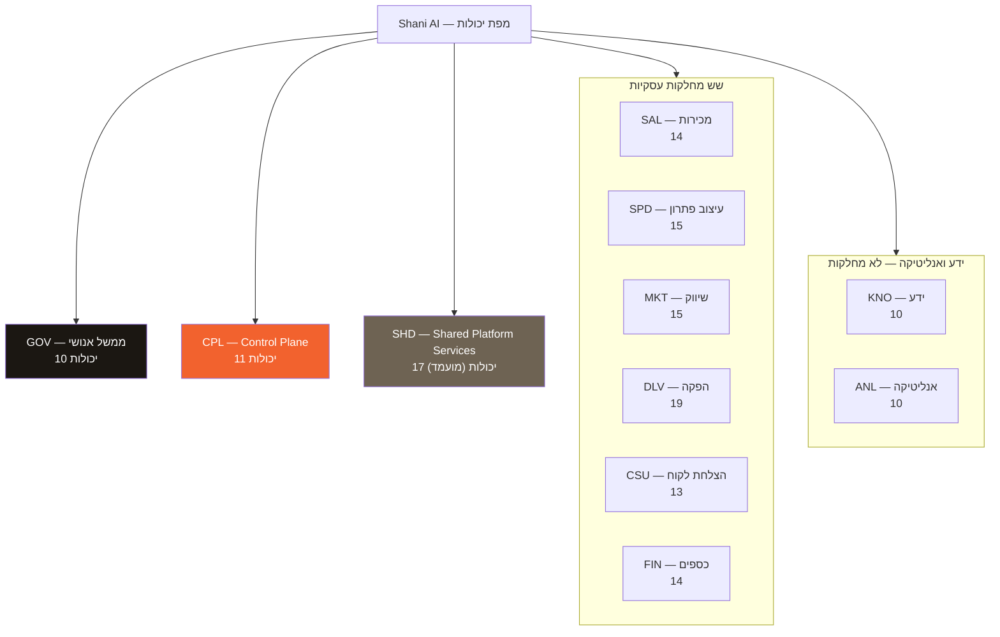
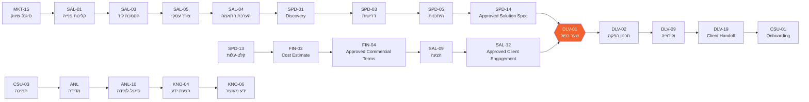
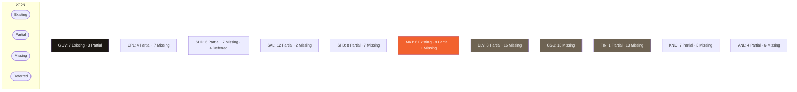
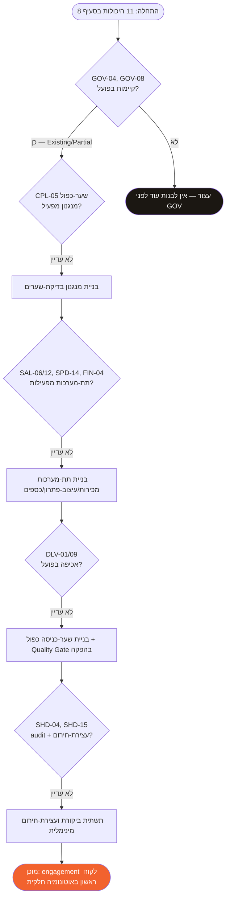

# 02-capability-map.md — מפת יכולות החברה: Shani AI

> מסמך ארכיטקטורה שלישי בסדרה. סמכות-על: `00-company-constitution.md` (עליון), אחריו
> `01-company-architecture.md`. כל סעיף כאן שסותר את אחד מהם בטל מולו. מסמך תכנון בלבד:
> **אין סוכנים, אין פרומפטים, אין קוד, אין סכימות, אין workflows, אין הקצאת כלים/ספקים.**
> marketing-engine ממשיך לפעול במיקומו הנוכחי, ללא שינוי וללא ריפקטור.

## סדר סמכות למסמך זה

1. `00-company-constitution.md`
2. `01-company-architecture.md`
3. מימוש מאומת בפועל (קבצים/סוכנים קיימים בריפו)
4. המלצות (מסומנות במפורש ככאלה)

## תיוגים

- **[אילוץ חוקתי]** — נובע ישירות מחוקה/מארכיטקטורה, מצוטט עם מספר סעיף.
- **[החלטה נוכחית]** — הכרעה שהתקבלה בקובץ זה.
- **[החלטה נדחית]** — טרם הוכרע, או נדחה במפורש עד שיודגם צורך.
- **[לא-מטרה]** — במכוון מחוץ לתחום המסמך.
- **[מומלץ]** — המלצה בלבד, לא הכרעה תפעולית.

---

## 0. עקרונות מפת היכולות

**[אילוץ חוקתי]** יכולת מתארת **מה** החברה חייבת להיות מסוגלת להשיג — לא **מי/מה מבצע** זאת.
עקבי עם עקרון "יכולת, לא כלי" ב-`production-architecture.md` §1, מורחב כאן לרמת החברה כולה.

**יכולת אינה:**

- agent
- תפקיד/משרה
- פרומפט
- כלי
- מימוש workflow
- משימה זעירה בודדת

יכולת אחת עשויה להיות ממומשת בעתיד ע"י כמה רכיבים. רכיב אחד עשוי לתמוך בכמה יכולות. מסמך
זה **אינו** קובע בעלות-מימוש מעבר לשכבה/מחלקה המנהלת — לא agent, לא רכיב טכני.

**[אילוץ חוקתי]** יכולת חייבת בעלים סמכותי אחד — שכבת-ממשל או מחלקה עסקית אחת בלבד (חוקה
§11; ארכיטקטורה §5). אסור בהחלט שיכולת תישאר בלי בעלים, ואסור בהחלט ששתי מחלקות תיחשבנה
בעלות סמכותיות על אותה יכולת בו-זמנית.

**איזון נדרש:** לא להשמיט יכולת חברתית מהותית; לא לפרק יכולות למיקרו-פעולות חסרות-משמעות.
כל יכולת מייצגת תוצאה עסקית/ממשלית נבדלת אחת.

**[לא-מטרה]** המסמך אינו מגדיר סכימות נתונים, ממשקי API, קוד, או תשתית טכנית לאף יכולת.

---

## 1. טקסונומיה ומוסכמות

### 1.1 מוסכמת מזהים

מזהים לוגיים יציבים בלבד — **אינם** מרמזים שייבנה agent:

| קידומת | שכבה/מחלקה |
|---|---|
| GOV | ממשל אנושי |
| CPL | Company Control Plane |
| SHD | Shared Platform Services |
| SAL | מכירות וקליטת לקוחות |
| SPD | עיצוב פתרון ומוצר |
| MKT | שיווק |
| DLV | הפקה ותפעול |
| CSU | הצלחת לקוח |
| FIN | כספים ומינהלה |
| KNO | ידע (יכולת כלל-חברתית) |
| ANL | אנליטיקה (יכולת כלל-חברתית) |

### 1.2 שדות חובה לכל יכולת

לכל יכולת מוגדרים 13 השדות הבאים, בשתי טבלאות משלימות לכל קבוצה: **טבלה א׳** (זהות ובעלות)
ו-**טבלה ב׳** (זרימה וממשל):

טבלה א׳: `ID` · שם היכולת · תוצאה עסקית/ממשלית · בעלים סמכותי · מחלקות/שכבות תומכות ·
סיכון · בשלות נוכחית · עדיפות.

טבלה ב׳: `ID` · קלטים עיקריים · פלטים עיקריים · גבול אישור/הכרעה אנושית · תלויות ביכולות
אחרות · עדות/כיסוי מאומת · חריגים/הערות גבול.

### 1.3 מודל סיכון — **[החלטה נוכחית]**, לא עובדה חוקתית קבועה

לפי חוקה §8: שלוש רמות נוכחיות (נמוכה/בינונית/גבוהה). מספר הרמות ושמותיהן אינם עובדה חוקתית
— ארכיטקטורה עתידית רשאית לעדן, ובלבד שרמת-הביטחון של האישורים לא נחלשת בשקט. סיווג-הסיכון
כאן הוא ברמת-יכולת (מגמה טיפוסית), לא ברמת-פעולה בודדת — סיווג פעולה בפועל תמיד ייגזר מחדש
לפי חוקה §8 בזמן האמת.

### 1.4 מודל בשלות — מבוסס-עדות בלבד

**[אילוץ חוקתי]** אסור בהחלט לסמן יכולת כ-Existing רק משום ש-Claude/ChatGPT מסוגלים לבצע
אותה בשיחה. **Existing** פירושו מנגנון/תת-מערכת חברתי מאושר, חוזר, ומתועד בפועל.

| בשלות | הגדרה מדויקת לשימוש במסמך זה |
|---|---|
| **Existing** | מנגנון מתועד, חוזר, מאושר, עם ריצה/שימוש אמיתי מאומת בריפו (למשל: סוכן שרץ בפועל והפיק תוצר בדוק) |
| **Partial** | האובייקט/הבעלות/גבול-האישור מוגדרים במפורש ב-`01-company-architecture.md` או בקובץ מאומת אחר, **אך אין מנגנון תפעולי שמפעיל זאת בפועל** |
| **Missing** | אין הגדרה פורמלית ואין מנגנון — לא ברמת ארכיטקטורה ולא ברמת מימוש |
| **Deferred** | תויג במפורש כ"החלטה נדחית" בחוקה או בארכיטקטורה — דחייה מודעת, לא פער שנשכח |

כשכיסוי לא ודאי — מסומן **"לא מאומת"** בשדה העדות, לא מונח כ-Existing.

### 1.5 מודל עדיפות

- **P0** — נדרש לפני שהחברה יכולה לתאם עבודה אוטונומית בבטחון כלשהי (שערי בטיחות, הסלמה, הרשאות-ליבה).
- **P1** — נדרש לפני שהחברה יכולה למכור ולספק engagement ללקוח בבטחון.
- **P2** — נדרש לתפעול שוטף אמין ולתמיכה.
- **P3** — אופטימיזציה, קנה-מידה, ואוטונומיה מתקדמת.

**[אילוץ חוקתי]** עדיפות אינה סדר-ביצוע כשלעצמה. תלויות וסיכון עשויים לעקוף מספור-עדיפות
פשוט בהמשך (עקבי עם עיקרון "בדיקה מול: האם זה יחזיק גם עם כמה מחלקות" — חוקה §2).

---

## 2. קטלוג יכולות מלא

### 2.1 ממשל אנושי (GOV)

**[אילוץ חוקתי]** ממשל אנושי אינו מיוצג כ-agent (ארכיטקטורה §1; חוקה §3). כל היכולות כאן הן
פעולות אנושיות של שני, מתועדות ואוכפות דרך מנגנוני החוקה — לא רכיבי-מערכת.

**טבלה א׳ — זהות ובעלות**

| ID | שם היכולת | תוצאה | בעלים | תומכים | סיכון | בשלות | עדיפות |
|---|---|---|---|---|---|---|---|
| GOV-01 | כיוון וסדרי-עדיפות חברתיים | אסטרטגיה ותעדוף מחלקות/מוצרים | ממשל אנושי | Control Plane (דיווח בלבד) | בינוני | Existing | P0 |
| GOV-02 | ממשל חוקתי | אישור/תיקון החוקה עצמה | ממשל אנושי | — | גבוה | Existing | P0 |
| GOV-03 | אישור מדיניות | אישור מדיניות-ממשל/מחלקתית מאושרת | ממשל אנושי | כל מחלקה (מציעה) | בינוני | Existing | P0 |
| GOV-04 | אישור סיכון-גבוה | אישור פעולות בלתי-הפיכות/סיכון-גבוה | ממשל אנושי | Control Plane (מסלים) | גבוה | Existing | P0 |
| GOV-05 | האצלת הרשאות | הענקת הרשאה מתועדת ל-agent/מחלקה/שירות | ממשל אנושי | Shared Services (רישום) | גבוה | Partial | P1 |
| GOV-06 | ביטול הרשאות | שלילה מיידית של הרשאה קיימת | ממשל אנושי | Shared Services (אכיפה) | גבוה | Partial | P0 |
| GOV-07 | פתרון סכסוכים | הכרעה סופית כשסדר-הקדימות לא פתר | ממשל אנושי | Control Plane (מסלים) | גבוה | Existing | P0 |
| GOV-08 | הפעלה/שחרור עצירת-חירום | הפעלה ושחרור עצירת-חירום ברמת-חברה | ממשל אנושי | כל השכבות (נענות) | גבוה | Partial | P0 |
| GOV-09 | אישור ארכיטקטורה | אישור מסמכי ארכיטקטורה/עיצוב agent | ממשל אנושי | — | בינוני | Existing | P0 |
| GOV-10 | קבלת סיכון מסחרי/תפעולי מהותי | אישור חשיפה מסחרית/תפעולית מהותית | ממשל אנושי | כספים, הפקה | גבוה | Existing | P1 |

**טבלה ב׳ — זרימה וממשל**

| ID | קלטים | פלטים | גבול אישור | תלויות | עדות | חריגים |
|---|---|---|---|---|---|---|
| GOV-01 | דוחות-מצב ממחלקות | כיווני-מדיניות | תמיד אנושי, בלעדי | — | תהליך העבודה בפרויקט זה עצמו (סדרת מסמכי ai-company/architecture) | לא כולל ניהול תפעולי שוטף |
| GOV-02 | הצעת-תיקון בכתב (חוקה §24) | גרסת חוקה חדשה | תמיד אנושי, בלעדי | GOV-09 | החוקה אושרה, תוקנה ונשמרה כמסמך ממשל מחייב. | תהליך 8 שלבים מחייב, חוקה §24 |
| GOV-03 | מדיניות מוצעת ממחלקה | אישור/דחייה | תמיד אנושי | GOV-01 | לא מאומת כמנגנון נפרד מ-GOV-02 עדיין | חופף חלקית ל-GOV-02 ברמת חומרה נמוכה יותר |
| GOV-04 | סיווג-סיכון (חוקה §8) | אישור/דחייה מתועדים | תמיד אנושי, ללא יוצא מן הכלל | — | חוקה §9 (פעולה בלתי-הפיכה תמיד אישור) | לא חל על פעולות הפיכות בסיכון נמוך |
| GOV-05 | מסמך-עיצוב agent/מחלקה/שירות מאושר | רשומת-הרשאה מתועדת | תמיד אנושי, בלעדי | SHD-01 | חוקה §20 — כלל קיים, לא הופעל בפועל עדיין | אסור הענקה "תוך כדי ריצה" |
| GOV-06 | בקשת-ביטול (שני יזמה) | חסימת פעולות-חדשות מיידית | תמיד אנושי, בלעדי | SHD-01, SHD-02 | חוקה §20 — כלל קיים, לא הופעל בפועל | פעולה-באמצע-ביצוע עוצרת ומסלימה |
| GOV-07 | סכסוך שסדר-הקדימות לא פתר | הכרעה מתועדת | תמיד אנושי | CPL-09 | שימוש חוזר בפועל בתהליך אישורי המסמכים הנוכחי | לא מיועד לסכסוכים שגרתיים (חוקה §5) |
| GOV-08 | חשד מאומת/סביר לפגיעה (חוקה §16) | עצירת/שחרור עבודה משנת-מצב | תמיד אנושי, בלעדי | כל CPL, כל SHD, כל מחלקה | ארכיטקטורה §4 — פירוש תפעולי קיים, מנגנון טכני לא | מימוש טכני = [החלטה נדחית] |
| GOV-09 | טיוטת מסמך ארכיטקטורה/עיצוב | אישור מפורש | תמיד אנושי | — | 3 מסמכי ai-company/architecture אושרו בפועל בתהליך זה | לא כולל אישור קוד בפועל (לא-מטרה בשלב זה) |
| GOV-10 | הצעת-מחיר/חשיפה מהותית מכספים/הפקה | אישור/דחייה | תמיד אנושי מעל סף (חוקה §8) | FIN-04, DLV-14 | אין עדיין מחלקת כספים/הפקה בפועל | תלוי בקיום FIN/DLV תפעוליים |

---

### 2.2 Company Control Plane (CPL)

**[אילוץ חוקתי]** Control Plane מוגבל לתיאום/ניתוב/צפייה/אכיפת-מדיניות-מאושרת (חוקה §22;
ארכיטקטורה §2). אסור בהחלט שיהיה בעל-נתונים של מחלקה, ואסור בהחלט שיהפוך ל-agent יחיד
בלתי-מוגבל. **היכולות הבאות אינן מיועדות להתכנס לרכיב-עתידי אחד** — עשויות להיות רכיבים
נפרדים בעלי הרשאות-עצמאיות (ארכיטקטורה §2).

**טבלה א׳ — זהות ובעלות**

| ID | שם היכולת | תוצאה | בעלים | תומכים | סיכון | בשלות | עדיפות |
|---|---|---|---|---|---|---|---|
| CPL-01 | קליטת עבודה חברתית | זיהוי עבודה חדשה שנכנסת למערכת | Control Plane | כל מחלקה (מקור) | בינוני | Missing | P1 |
| CPL-02 | סיווג עבודה | קביעת סוג/סיכון ראשוני של עבודה נכנסת | Control Plane | ממשל (מדיניות) | בינוני | Missing | P1 |
| CPL-03 | ניתוב למחלקות | הפניית עבודה למחלקה הנכונה | Control Plane | כל מחלקה | בינוני | Missing | P1 |
| CPL-04 | תיאום חוצה-מחלקה | סנכרון התקדמות עבודה בין מחלקות | Control Plane | כל מחלקה | בינוני | Missing | P1 |
| CPL-05 | בדיקת שערים | וידוא שארטיפקטים נדרשים קיימים לפני מעבר | Control Plane | הפקה (שער כפול) | גבוה | Partial | P0 |
| CPL-06 | מעקב מחזור-חיים ברמה-גבוהה | תמונת-מצב לוגית של עבודה בתהליך | Control Plane | Company Registry | נמוך | Missing | P2 |
| CPL-07 | ניטור תלויות | זיהוי חסימות/תלות שלא התקדמה | Control Plane | כל מחלקה | בינוני | Missing | P1 |
| CPL-08 | הסלמת כשלים | העברת כשל שלא נפתר לממשל | Control Plane | ממשל אנושי | גבוה | Partial | P0 |
| CPL-09 | הסלמת אישורים | העברת בקשת-אישור שלא טופלה | Control Plane | ממשל אנושי | גבוה | Partial | P0 |
| CPL-10 | הסלמת תקריות | העברת תקרית מהותית (חוקה §23) | Control Plane | ממשל אנושי | גבוה | Partial | P0 |
| CPL-11 | צפייה במצב-זרימת-עבודה | תצוגת סטטוס ברמה-גבוהה בלבד | Control Plane | אנליטיקה (קריאה) | נמוך | Missing | P2 |

**טבלה ב׳ — זרימה וממשל**

| ID | קלטים | פלטים | גבול אישור | תלויות | עדות | חריגים |
|---|---|---|---|---|---|---|
| CPL-01 | פנייה/artifact חדש ממחלקה | רישום-כניסה לוגי | ללא אישור נפרד (מנגנון תשתית) | — | אין מנגנון קיים; רק תיאור לוגי בארכיטקטורה §2 | לא כולל יצירת/עריכת תוכן העבודה עצמה |
| CPL-02 | סיווג-סיכון מדיניות (חוקה §8) | תיוג-סיכון ראשוני | ללא אישור נפרד; חוקה §8 חלה בהמשך | GOV-03 | — | אינו קובע סיווג סופי — המחלקה/חוקה קובעים |
| CPL-03 | תוצאת CPL-02 | ניתוב לוגי למחלקה יעד | ללא אישור נפרד | CPL-01, CPL-02 | ארכיטקטורה §2 "אחראי ל" | אסור בהחלט לכתוב ישירות למצב-מחלקה |
| CPL-04 | דיווחי-סטטוס ממחלקות | תיאום-לוח-זמנים לוגי | ללא אישור נפרד | CPL-03 | — | אינו בעל אף work object (ארכיטקטורה §9) |
| CPL-05 | Approved Solution Specification + Approved Client Engagement | אישור/חסימת מעבר להפקה | תמיד בדיקה-בלבד, לא יצירה/אישור-בעלים | SPD-14, SAL-12 | ארכיטקטורה §5.4, §10.2 (GateD) — מוגדר, לא מופעל | Control Plane אינו יוצר/מאשר אף ארטיפקט בעצמו |
| CPL-06 | סטטוס-על ממחלקות | תמונת-מצב לוגית | קריאה-בלבד | Company Registry (§7) | — | לא מכיל את הנתון המהותי עצמו |
| CPL-07 | לוחות-זמנים/תלויות מוצהרות | דוח-חסימה | ללא אישור נפרד | CPL-04 | — | לא פותר תלות בעצמו — מדווח בלבד |
| CPL-08 | כשל שלא נפתר בזמן סביר | דיווח מובנה לממשל | הסלמה בלבד, לא הכרעה | GOV-07 | — | לא מחליט בעצמו על התוצאה |
| CPL-09 | בקשת-אישור תקועה | הסלמה לממשל | הסלמה בלבד | GOV-04, GOV-07 | — | אינו יכול לאשר בעצמו במקום שני |
| CPL-10 | תקרית מהותית (חוקה §23) | דיווח + רצף-תקרית | הסלמה לפי רצף חוקה §23 | GOV-08, SHD-15 | — | אינו סוגר תקרית בעצמו — שני מאשרת סגירה |
| CPL-11 | דיווחי-סטטוס | תצוגה מצטברת | קריאה-בלבד | ANL-04 | — | אינו כלי-דיווח לצד ג׳ — פנימי בלבד |

---

### 2.3 Shared Platform Services (SHD)

**[אילוץ חוקתי]** רכיב עובר לשכבה הזו רק כשקיים צרכן שני אמיתי (חוקה §25; ארכיטקטורה §3).
**היכולות כאן הן מועמדות בלבד.** אף אחת מהן אינה מחולצת בפועל היום — כרגע יש מחלקה תפעולית
אחת בלבד (שיווק), כך שאין עדיין שימוש-חוזר אמיתי בין מחלקות. שימוש בפועל בתוך מחלקה אחת
בלבד **אינו** מספיק כדי לתייג יכולת כשירות-משותפת שחולצה.

**טבלה א׳ — זהות ובעלות**

| ID | שם היכולת | תוצאה | בעלים | תומכים | סיכון | בשלות | עדיפות |
|---|---|---|---|---|---|---|---|
| SHD-01 | ניהול זהות | מי מורשה למה, ברמת-חברה | Shared Services (מועמד) | ממשל (מאשר) | גבוה | Deferred | P1 |
| SHD-02 | אכיפת הרשאות | מניעת פעולה מעבר להרשאה | Shared Services (מועמד) | Control Plane | גבוה | Deferred | P1 |
| SHD-03 | ניהול בקשות-אישור | תור/מסלול-הסלמה לבקשות אישור | Shared Services (מועמד) | ממשל, Control Plane | בינוני | Deferred | P1 |
| SHD-04 | רישום-ביקורת (audit) | תיעוד נצפה-וניתן-לייחוס לכל פעולה | Shared Services (מועמד) | כל מחלקה | גבוה | Partial | P0 |
| SHD-05 | תצפיתיות (observability) | ניטור מצב-מערכת ברמה-גבוהה | Shared Services (מועמד) | Control Plane | נמוך | Missing | P2 |
| SHD-06 | תעבורת אירועים | הודעות בין מחלקות | Shared Services (מועמד) | כל מחלקה | בינוני | Missing | P2 |
| SHD-07 | תמיכת הרצת workflow | הרצת רצף שה-Control Plane קובע | Shared Services (מועמד) | Control Plane | בינוני | Missing | P2 |
| SHD-08 | גישה ל-Company Registry | ממשק-קריאה/כתיבה לרשומת-הפניות | Shared Services (מועמד) | כל מחלקה | נמוך | Missing | P2 |
| SHD-09 | גישה למדיניות וידע | קריאה-בלבד למדיניות/ידע מאושרים | Shared Services (מועמד) | KNO | נמוך | Partial | P2 |
| SHD-10 | רשומת-יכולות-כלים | תרגום יכולת→כלי, במקום אחד | Shared Services (מועמד) | שיווק (תקדים) | נמוך | Partial | P2 |
| SHD-11 | טיפול בסודות ואישורי-גישה | ניהול credentials בבטחה | Shared Services (מועמד) | ממשל | גבוה | Missing | P1 |
| SHD-12 | מעקב עלות ומשאבים | תצפית תקציב לכל פעולה אוטונומית | Shared Services (מועמד) | כספים | בינוני | Partial | P1 |
| SHD-13 | תשתית ולידציה | תמיכה בביקורת עצמאית (חוקה §13) | Shared Services (מועמד) | שיווק (תקדים) | בינוני | Partial | P1 |
| SHD-14 | תמיכת תקריות | תמיכה טכנית לרצף חוקה §23 | Shared Services (מועמד) | Control Plane | בינוני | Missing | P1 |
| SHD-15 | תמיכת עצירת-חירום | תמיכה טכנית לחוקה §16 | Shared Services (מועמד) | כל השכבות | גבוה | Deferred | P0 |
| SHD-16 | גיבוי ושחזור | ציפיית גיבוי-ושחזור לכל מקור-אמת | Shared Services (מועמד) | כל מחלקה | גבוה | Missing | P1 |
| SHD-17 | תמיכת גרסה ומיגרציה | ניהול שינויי-גרסה/מיגרציה | Shared Services (מועמד) | ממשל | נמוך | Missing | P2 |

**טבלה ב׳ — זרימה וממשל**

| ID | קלטים | פלטים | גבול אישור | תלויות | עדות | חריגים |
|---|---|---|---|---|---|---|
| SHD-01 | מסמכי-עיצוב מאושרים (GOV-05) | רשומת-זהות | שני מאשרת כל הענקה | GOV-05 | אין מימוש; חוקה §20 מגדירה כלל בלבד | לא agent — יכולת תשתית בלבד |
| SHD-02 | רשומת-זהות (SHD-01) | חסימה/היתר בזמן-ריצה | ללא אישור נפרד; אוכפת מדיניות קיימת | SHD-01 | — | אסור בהחלט שתרחיב הרשאות (חוקה §17) |
| SHD-03 | בקשת-אישור מ-agent/מחלקה | ניתוב לממשל/Control Plane | לא מאשרת בעצמה | GOV-04, CPL-09 | — | אינה מחליטה — רק מנתבת בקשות |
| SHD-04 | כל פעולה אוטונומית | רשומת-ביקורת מתועדת | ללא אישור נפרד | — | `knowledge/runs.md` — תקדים עובד בתוך שיווק בלבד | דיווח מילולי בלי רישום = לא-תיעוד (חוקה §14) |
| SHD-05 | דיווחי-סטטוס משכבות | תצוגה מצטברת | קריאה-בלבד | CPL-11 | — | לא מחליף דיווח-ישיר לממשל בתקרית |
| SHD-06 | הודעה ממחלקה שולחת | העברה למחלקה מקבלת | לא מחליף artifact מאושר (חוקה §10) | — | — | לא תחליף לתקשורת-דרך-artifacts |
| SHD-07 | רצף מאושר מ-Control Plane | הרצת-רצף בפועל | Control Plane מחליט; זה מבצע תשתית בלבד | CPL-04 | — | לא קובעת מדיניות-ניתוב בעצמה |
| SHD-08 | הפניה/מזהה ממחלקה | רישום/עדכון הפניה | מחלקה-בעלת בלבד (סעיף Registry) | — | — | אסור בהחלט לשכפל מצב-דומיין מלא |
| SHD-09 | בקשת-קריאה מאושרת | מדיניות/ידע רלוונטי | קריאה-בלבד | KNO-01 | תקדים חלקי: קבצי `config/`, `brand/` בשיווק | לא מספקת ידע לא-מאושר |
| SHD-10 | הצעת-עדכון (Tool Intelligence, עתידי) | רישום יכולת→כלי מעודכן | שינוי כלי-ראשי = שני חובה | GOV-05 | `marketing-engine/config/tools.md` — קיים ופעיל בתוך שיווק, 18 יכולות רשומות | תקדים מחלקתי בלבד — טרם חולץ לשכבה משותפת |
| SHD-11 | בקשת-גישה ל-secret | אספקת credential מבוקר | שני מאשרת גישה חדשה | SHD-01 | אין מימוש | לא נוגעת בערכי-סוד עצמם במסמך זה |
| SHD-12 | תקציב-מוגדר-מראש (חוקה §19) | דיווח חריגה | חריגה = עצירה ודיווח, לא המשך | — | `config/settings.md` — תקציב-חיפושים לחוקרת, תקדים מחלקתי | טרם מאוחד ברמת-חברה (חוקה §19, נדחה) |
| SHD-13 | תוצר בסיכון-גבוה | אישור ביקורת-עצמאית | נדרש כשחוקה §13 דורשת | — | תבנית Reviewer (עיניים-טריות) — תקדים מחלקתי מוכח | טרם כלי-תשתית כללי — כרגע agent ייעודי בשיווק בלבד |
| SHD-14 | תקרית מדווחת | תמיכה טכנית ברצף חוקה §23 | תומכת, לא מחליטה | CPL-10 | — | אינה מחליפה את שלבי הרצף האנושיים |
| SHD-15 | הפעלת עצירת-חירום (GOV-08) | חסימת נתיבי-ביצוע מושפעים | שני בלבד מפעילה/משחררת | GOV-08 | ארכיטקטורה §4 — פירוש תפעולי בלבד | מימוש טכני קונקרטי = [החלטה נדחית] |
| SHD-16 | מקור-אמת בסביבת-ייצור | ציפיית שחזור מאומתת | נדרש אישור-מדיניות | — | אין מימוש טכני עדיין | טכנולוגיות קונקרטיות = [החלטה נדחית], חוקה §21 |
| SHD-17 | שינוי-מדיניות-ליבה | תיעוד גרסה/מיגרציה | שינוי-קבע = תהליך תיקון (חוקה §24) | GOV-02 | 3 מסמכי ai-company/architecture עם גרסאות מתועדות | לא כולל מיגרציית-נתונים טכנית |

---

### 2.4 מכירות וקליטת לקוחות (SAL)

**[אילוץ חוקתי]** מכירות היא הבעלים הסמכותי היחיד של רשומת Client (ארכיטקטורה §5.1). **אינה
כוללת** עיצוב-פתרון-טכני-סופי או אישור פיננסי (ארכיטקטורה §5.1, §5.2, §5.6). המחלקה עצמה
טרם קיימת כתת-מערכת מופעלת — כל היכולות כאן מוגדרות ברמת ארכיטקטורה בלבד (§5.1, §8, §9).

**טבלה א׳ — זהות ובעלות**

| ID | שם היכולת | תוצאה | בעלים | תומכים | סיכון | בשלות | עדיפות |
|---|---|---|---|---|---|---|---|
| SAL-01 | קליטת פנייה | רישום פנייה נכנסת ראשונית | מכירות | שיווק (מקור) | נמוך | Partial | P1 |
| SAL-02 | נירמול ליד | איחוד פנייה גולמית לרשומת Lead אחידה | מכירות | — | נמוך | Partial | P1 |
| SAL-03 | הסמכת ליד | קביעה אם הפנייה הופכת ל-Qualification | מכירות | — | בינוני | Partial | P1 |
| SAL-04 | הערכת התאמה | האם ההזדמנות מתאימה לשירותי החברה | מכירות | עיצוב-פתרון (ייעוץ) | בינוני | Partial | P1 |
| SAL-05 | תיעוד צורך עסקי | לכידת Business Need כפי שהלקוח ניסח | מכירות | — | נמוך | Partial | P1 |
| SAL-06 | ניהול רשומת Client | בעלות בלעדית על רשומת-הזהות המרכזית | מכירות | הצלחת-לקוח, כספים, הפקה (הפניה בלבד) | בינוני | Partial | P0 |
| SAL-07 | ניהול הזדמנות מכירה | מעקב Sales Opportunity לאורך חייה | מכירות | — | נמוך | Partial | P1 |
| SAL-08 | ניהול שיחה מסחרית | תיעוד Commercial Conversation | מכירות | — | נמוך | Missing | P2 |
| SAL-09 | הכנת הצעה | ניסוח Proposal על בסיס מפרט/תמחור מאושרים | מכירות | עיצוב-פתרון, כספים | בינוני | Partial | P1 |
| SAL-10 | ניהול מחזור-חיי הצעה | מעקב Proposal — נשלחה/נדחתה/פגה | מכירות | — | בינוני | Partial | P1 |
| SAL-11 | אישור הסכמת-לקוח | וידוא הסכמה בפועל לפני התקשרות | מכירות | — | גבוה | Missing | P1 |
| SAL-12 | יצירת Approved Client Engagement | השער המסחרי/לקוחי לפני הפקה | מכירות | כספים (קלט), הפקה (מקבל) | גבוה | Partial | P0 |
| SAL-13 | מסירה להפקה | שער-מסירה מסודר לתחילת עבודה | מכירות | הפקה | בינוני | Partial | P1 |
| SAL-14 | תיעוד אובדן/דחייה | רישום מצב-סיום שגרתי (לא הוסמך/בוטל) | מכירות | — | נמוך | Partial | P1 |

**טבלה ב׳ — זרימה וממשל**

| ID | קלטים | פלטים | גבול אישור | תלויות | עדות | חריגים |
|---|---|---|---|---|---|---|
| SAL-01 | פנייה חיצונית, Qualified Marketing Lead | Lead / Client Inquiry | ללא אישור נפרד | MKT-15 | ארכיטקטורה §5.1 בעלות-נתונים "Lead · Client Inquiry" | לא כולל דירוג-איכות תוכן (זה MKT) |
| SAL-02 | Lead גולמי | Lead מנורמל | ללא אישור נפרד | SAL-01 | — | אינה יכולת נבדלת בארכיטקטורה — נגזרת מ-SAL-01/03 |
| SAL-03 | Lead מנורמל | Qualification | ללא אישור נפרד ברמה-נמוכה | SAL-02 | ארכיטקטורה §5.1 "הסמכה", §9 (מצב-סיום "לא הוסמך") | ספק בשער = דחייה, לא ניחוש |
| SAL-04 | Qualification | הערכת-התאמה ראשונית | ללא אישור נפרד | SAL-03 | — | אינה עיצוב-פתרון טכני — זה SPD |
| SAL-05 | שיחה עם הלקוח | Business Need | ללא אישור נפרד | SAL-04 | ארכיטקטורה §5.2 (הבחנת Business Need מ-Requirements) | לא נדרסת ע"י Requirements של עיצוב-פתרון |
| SAL-06 | פרטי-זהות/קשר מאומתים | רשומת Client (Client ID + שדות מוגדרים) | שינוי בעלות = אסור בהחלט למחלקה אחרת | — | ארכיטקטורה §5.1 "בעלים יחיד: מכירות" — הכרעה מפורשת | מכיל רק שדות-זהות, לא נתוני-דומיין של מחלקות אחרות |
| SAL-07 | Qualification + Business Need | Sales Opportunity | ללא אישור נפרד | SAL-03, SAL-05 | ארכיטקטורה §5.1 בעלות-נתונים | לא כולל אומדן-מחיר (זה כספים) |
| SAL-08 | תקשורת עם הלקוח | תיעוד שיחה | ללא אישור נפרד | SAL-07 | — | לא ארטיפקט חוצה-מחלקה בפני עצמו |
| SAL-09 | Approved Solution Specification, Approved Commercial Terms | Proposal | Proposal בבעלות מכירות; תוכן טכני/מחיר מקורם SPD/FIN | SPD-14, FIN-04 | ארכיטקטורה §8 טבלת בעלות-ארטיפקטים | אסור בהחלט לכתוב-מחדש מפרט/מחיר שהתקבלו |
| SAL-10 | Proposal | סטטוס נשלחה/נדחתה/פגה/התקבלה | ללא אישור נפרד; דחייה שגרתית ≠ הסלמה | SAL-09 | ארכיטקטורה §9 עקרון-ההבחנה | דחייה שגרתית לא מגיעה לממשל |
| SAL-11 | Proposal שהתקבלה | אישור-הסכמה מתועד | תמיד תיעוד מפורש לפני SAL-12 | SAL-10 | — | אין הסכמה משתמעת |
| SAL-12 | Approved Commercial Terms (כספים) + הסכמת-לקוח (SAL-11) | Approved Client Engagement | שני שערים — מסחרי בלבד; אינו תלוי במפרט טכני | FIN-04, SAL-11 | ארכיטקטורה §5.1 גבולות-אישור | אינו מחליף Approved Solution Specification בשער הכפול להפקה |
| SAL-13 | Approved Client Engagement + Approved Solution Specification | פתיחת עבודה בהפקה | Control Plane בודק בלבד (CPL-05) | SAL-12, SPD-14 | ארכיטקטורה §5.4 שער כפול | לא כולל תכנון-עבודה עצמו (זה הפקה) |
| SAL-14 | תוצאת שער שנכשלה (לא הוסמך/נדחתה/בוטלה) | רשומת מצב-סיום | ללא הסלמה, אלא אם סכסוך-לא-פתור | SAL-03, SAL-10, SAL-12 | ארכיטקטורה §9 טבלת מצבי-סיום שגרתיים | לא נרשם כתקרית אלא אם חריג לעקרון-ההבחנה |

---

### 2.5 עיצוב פתרון ומוצר (SPD)

**[אילוץ חוקתי]** Approved Solution Specification נשלמת ומאושרת טכנית באופן עצמאי —
**אינה תלויה** בקבלת Approved Commercial Terms (ארכיטקטורה §5.2, תיקון מפורש מהביקורת
העצמאית). **אינה כוללת** אישור-מחיר סופי, חשבונאות, או ביצוע-הפקה בפועל.

**טבלה א׳ — זהות ובעלות**

| ID | שם היכולת | תוצאה | בעלים | תומכים | סיכון | בשלות | עדיפות |
|---|---|---|---|---|---|---|---|
| SPD-01 | תכנון Discovery | הגדרת היקף/שיטת בירור-צרכים | עיצוב-פתרון | מכירות (הפניה) | נמוך | Missing | P1 |
| SPD-02 | בירור תהליכים עסקיים | מיפוי תהליך הלקוח בפועל | עיצוב-פתרון | — | נמוך | Missing | P1 |
| SPD-03 | חילוץ דרישות | תרגום צורך לדרישות מפורשות | עיצוב-פתרון | — | בינוני | Partial | P1 |
| SPD-04 | ניתוח דרישות | בדיקת עקביות/היתכנות ראשונית של הדרישות | עיצוב-פתרון | — | בינוני | Partial | P1 |
| SPD-05 | הערכת היתכנות | Feasibility — אפשרי טכנית או לא | עיצוב-פתרון | — | בינוני | Partial | P1 |
| SPD-06 | הערכת חלופות פתרון | השוואת אפשרויות פתרון אפשריות | עיצוב-פתרון | — | בינוני | Missing | P1 |
| SPD-07 | הגדרת היקף | Scope סופי לעבודה המוצעת | עיצוב-פתרון | — | בינוני | Partial | P1 |
| SPD-08 | הצעת ארכיטקטורה | Architecture Proposal ברמה-לוגית | עיצוב-פתרון | — | בינוני | Partial | P1 |
| SPD-09 | הערכת אינטגרציה | בדיקת חיבור למערכות/כלים קיימים אצל הלקוח | עיצוב-פתרון | — | בינוני | Missing | P1 |
| SPD-10 | שיקולי נתונים ואבטחה | זיהוי סיכוני מידע/אבטחה בפתרון המוצע | עיצוב-פתרון | ממשל (סיכון-גבוה) | גבוה | Missing | P0 |
| SPD-11 | הגדרת קריטריוני-קבלה | Acceptance Criteria למדידת הצלחה | עיצוב-פתרון | הפקה (Quality Gate) | בינוני | Partial | P1 |
| SPD-12 | קלט לאומדן-אספקה | תשומה לתכנון-זמנים בהפקה | עיצוב-פתרון | הפקה | נמוך | Missing | P1 |
| SPD-13 | קלט לאומדן-עלות | תשומה טכנית לתמחור כספים | עיצוב-פתרון | כספים | בינוני | Missing | P1 |
| SPD-14 | יצירת Approved Solution Specification | השער הטכני לפני הפקה, עצמאי ממסחרי | עיצוב-פתרון | הפקה (מקבל) | גבוה | Partial | P0 |
| SPD-15 | ניהול תיקון-פתרון | עדכון מפרט לאחר משוב/שינוי-דרישה | עיצוב-פתרון | — | בינוני | Missing | P2 |

**טבלה ב׳ — זרימה וממשל**

| ID | קלטים | פלטים | גבול אישור | תלויות | עדות | חריגים |
|---|---|---|---|---|---|---|
| SPD-01 | Solution Assessment Request (ממכירות) | תוכנית-Discovery | ללא אישור נפרד | SAL-04 | ארכיטקטורה §8 טבלת ממשקים | לא מתחילה בלי בקשה ממכירות |
| SPD-02 | תוכנית-Discovery | ממצאי-תהליך | ללא אישור נפרד | SPD-01 | — | לא מבטיחה תאריך/מחיר (ארכיטקטורה §5.2 אי-אחריות) |
| SPD-03 | ממצאי Discovery | Requirements | ללא אישור נפרד; אינה דורסת Business Need | SPD-02 | ארכיטקטורה §5.2 הבהרת Business Need↔Requirements | שני האובייקטים מתקיימים במקביל |
| SPD-04 | Requirements | דרישות מאושרות-פנימית | ללא אישור נפרד | SPD-03 | — | לא כוללת אישור-לקוח (זה מכירות) |
| SPD-05 | Requirements מנותחות | Feasibility | ללא אישור נפרד; חוסר-היתכנות = מצב-סיום שגרתי | SPD-04 | ארכיטקטורה §9 "לא אפשרי טכנית" | לא הסלמה אוטומטית — לולאת-תיקון אפשרית |
| SPD-06 | Feasibility חיובית | חלופת-פתרון מומלצת | ללא אישור נפרד | SPD-05 | — | לא כולל בחירת-כלי/ספק (לא-מטרה) |
| SPD-07 | חלופה שנבחרה | Scope | ללא אישור נפרד | SPD-06 | — | שינוי-היקף מאוחר = חוזר למכירות/כספים |
| SPD-08 | Scope | Architecture Proposal | ללא אישור נפרד | SPD-07 | — | ברמה לוגית בלבד — לא סכימת-מימוש |
| SPD-09 | Architecture Proposal | הערכת-סיכון אינטגרציה | ללא אישור נפרד | SPD-08 | — | לא כולל הרשאות/גישה בפועל למערכות הלקוח |
| SPD-10 | Architecture Proposal + נתוני-לקוח רגישים | דגלי-סיכון אבטחה/פרטיות | סיכון-גבוה → ממשל (חוקה §8) | SPD-09, GOV-04 | חוקה §12 (מחזור-חיים ופרטיות) | לא מחליף ייעוץ משפטי — חוקה §12 מבהירה זאת |
| SPD-11 | Scope + Architecture Proposal | Acceptance Criteria | ללא אישור נפרד | SPD-07, SPD-08 | ארכיטקטורה §5.2 הבהרת Acceptance Criteria↔Quality Gate | Quality Gate (הפקה) יורש ממנה, לא כותב-מחדש |
| SPD-12 | Scope | תשומת-זמן להפקה | ללא אישור נפרד | SPD-07 | — | לא מחייב תאריך ללקוח — זה מכירות/הפקה |
| SPD-13 | Scope | תשומת-עלות לכספים | ללא אישור נפרד | SPD-07 | ארכיטקטורה §8 "Pricing Input Request" | לא קובעת מחיר סופי — זה כספים בלבד |
| SPD-14 | Discovery+Feasibility+Scope+Requirements+Architecture+Acceptance Criteria+ביקורת-טכנית | Approved Solution Specification | עיצוב-פתרון משלימה לבדה; **אינה ממתינה למסחרי** | SPD-03..SPD-11 | ארכיטקטורה §5.2 — תיקון מפורש מהביקורת העצמאית | שער נפרד מ-SAL-12; שניהם נדרשים ל-DLV-01 |
| SPD-15 | משוב הפקה/מכירות על מפרט קיים | גרסת-מפרט מעודכנת | ללא אישור נפרד לתיקון קטן | SPD-14 | — | שינוי-היקף מהותי חוזר דרך SPD-07 מחדש |

---

### 2.6 שיווק (MKT)

**[אילוץ חוקתי]** marketing-engine הקיים שייך למחלקה הזו במלואו, במיקומו הנוכחי, ללא שינוי
(חוקה §4, §11; ארכיטקטורה §5.3). זוהי **המחלקה היחידה בחברה עם כיסוי מאומת בפועל** — שלושה
סוכנים (חוקרת/יוצרת/מבקרת) בנויים ונבדקו על ריצה אמיתית אחת מקצה-לקצה (OPP-20260713-1 →
PKG-20260713-claude-code-agent-view → `approved` ב-ledger). **אין** להרחיב תבניות מנוע-השיווק
לתשתית כלל-חברתית במסמך זה (לא-מטרה מפורשת).

**טבלה א׳ — זהות ובעלות**

| ID | שם היכולת | תוצאה | בעלים | תומכים | סיכון | בשלות | עדיפות |
|---|---|---|---|---|---|---|---|
| MKT-01 | תחקיר קהל | הבנת קהל-היעד וצרכיו | שיווק | — | נמוך | Partial | P2 |
| MKT-02 | תחקיר שוק ומתחרים | מעקב אחר שוק/יוצרי-תוכן/מתחרים | שיווק | — | נמוך | Partial | P2 |
| MKT-03 | זיהוי הזדמנות-תוכן | איתור נושא/רעיון בעל פוטנציאל | שיווק | — | נמוך | **Existing** | P1 |
| MKT-04 | דירוג הזדמנויות | ניקוד לפי קריטריונים מוגדרים-מראש | שיווק | — | נמוך | **Existing** | P1 |
| MKT-05 | אסטרטגיית תוכן | עמודי-תוכן, יחסי-חלוקה, שאלת-מפתח | שיווק | — | נמוך | **Existing** | P1 |
| MKT-06 | ממשל מותג וקול | קול-מותג, כללי-טון, איסורים לשוניים | שיווק | ממשל (אישור-בסיס) | בינוני | **Existing** | P1 |
| MKT-07 | יצירת תוכן | הפקת חבילת-תוכן מלאה מהזדמנות מאושרת | שיווק | — | בינוני | **Existing** | P1 |
| MKT-08 | ביקורת תוכן עצמאית | בדיקת עובדות/טון/עקביות ע"י גורם נפרד | שיווק | — | בינוני | **Existing** | P1 |
| MKT-09 | תכנון הפקה | תכנון הפקת נכסים חזותיים/וידאו לחבילה | שיווק | — | נמוך | Partial | P2 |
| MKT-10 | הפקת מדיה | ייצור סליידים/וידאו/קול בפועל | שיווק | — | בינוני | Partial | P2 |
| MKT-11 | תכנון הפצה | לוח-פרסום, תדירות, ערוצים | שיווק | — | נמוך | Partial | P2 |
| MKT-12 | תיאום פרסום | ביצוע/אישור פרסום בפועל | שיווק | ממשל (פרסום=בלתי-הפיך) | גבוה | Partial | P1 |
| MKT-13 | מדידת קמפיין | איסוף נתוני-ביצועים אמיתיים | שיווק | אנליטיקה | נמוך | Partial | P2 |
| MKT-14 | למידת ביצועים | כיול ידע-מה-עובד מנתוני-ביצועים | שיווק | ידע | נמוך | Partial | P2 |
| MKT-15 | מסירת סיגנל-שיווק למכירות | Qualified Marketing Lead / Campaign Signal | שיווק | מכירות (מקבל) | בינוני | Missing | P1 |

**טבלה ב׳ — זרימה וממשל**

| ID | קלטים | פלטים | גבול אישור | תלויות | עדות | חריגים |
|---|---|---|---|---|---|---|
| MKT-01 | `config/sources.md`, תוכן שפורסם בעבר | הבנת-קהל משתמעת בקריטריוני-ניקוד | ללא אישור נפרד | — | `config/scoring.md` — "רלוונטיות לקהל" כקריטריון ניקוד; אין מסמך-קהל נפרד | לא מנותח כמסמך persona פורמלי — פער |
| MKT-02 | `config/content-pillars.md` עמ׳ 2, רשת פתוחה | ממצאים על כלים/מתחרים כנושא-תוכן | תקציב-חיפושים מ-`settings.md` | — | חוקרת (`researcher.md`) — קיימת ונבדקה | מתמקד בתוכן-על-הכלים, לא מודיעין-תחרותי מלא |
| MKT-03 | `sources.md`, רשת פתוחה, IG בימי-דפדפן | `library/inbox/*.md`, `library/opportunities/OPP-*.md` | שער-ערך-לקהל + שער-עמוד; ספק=דחייה | MKT-01, MKT-02 | ריצה אמיתית מאומתת: `OPP-20260713-1.md`, ציון 76/100 | אין מקור=אין ממצא (חוקרת, חוק-ברזל 1) |
| MKT-04 | ממצא שעבר שער | ציון מפורק לפי `scoring.md` | ללא אישור נפרד | MKT-03 | ניקוד מתועד בפועל ב-OPP-20260713-1 | דה-דופ מול `ledger.md` מחייב |
| MKT-05 | `content-strategy.md`, `content-pillars.md` | עדיפויות-תוכן ל-MKT-03/07 | שני עורכת חופשי | — | `config/content-strategy.md`, `config/content-pillars.md` — קיימים, בשימוש פעיל ע"י 3 הסוכנים | לא כולל תמחור/הצעות (offers/ הוא ידע-עזר בלבד) |
| MKT-06 | ניתוח תוכן קיים (Bootstrap, ארכיטקטורה §7) | `brand/voice.md` | שני מאשרת תוצאה | — | `brand/voice.md` — נבנה בשלב האתחול, בשימוש ע"י Creator+Reviewer | לא מכסה מיתוג עסק ההחלקות (עסק נפרד) |
| MKT-07 | הזדמנות `fresh` ב-ledger + voice.md + patterns.md | `packages/<slug>/package.md`, עדכון ledger | ללא אישור נפרד; אין עיגון=אין טענה | MKT-03, MKT-04, MKT-06 | Creator (`creator.md`) — ריצה אמיתית: PKG-20260713-claude-code-agent-view | אין תחקיר עצמאי, אין מחיר בשום מקום |
| MKT-08 | package.md בסטטוס `draft` | סטטוס `approved`/`needs-revision` + `review.md` | תוצאה בינארית בלבד; אינה עורכת את החבילה | MKT-07 | Reviewer (`reviewer.md`) — ריצה אמיתית: PKG-... אושרה בפועל | package.md "קדוש" — אף תו לא משתנה |
| MKT-09 | package.md מאושר, `tools.md` | תוכנית-הפקה לוגית (יכולת→כלי) | ללא אישור נפרד | MKT-08 | `production-architecture.md` — תוכנית מגירה מלאה מתועדת | Producer (agent) טרם נבנה בפועל |
| MKT-10 | תוכנית-הפקה, `tools.md` | סליידים/וידאו/קול בפועל | שינוי כלי-ראשי = שני חובה | MKT-09 | `carousels/gen_v6.py` מוכח (CAP-05/18 ב-tools.md); שאר היכולות `unassigned`/המלצה-בלבד | ריל/וידאו-AI עדיין ברובם `unassigned` (tools.md) |
| MKT-11 | `docs/posting-schedule` וכדומה | לוח-פרסום מעודכן | שני עורכת חופשי | — | קבצי `docs/` קיימים כחומר-רקע | לא אוטומציה פעילה — מסמכי-עזר בלבד |
| MKT-12 | חבילה מוכנה + תזמון | פרסום בפועל | **תמיד** אישור/ביצוע אנושי (חוקה §9, פעולה בלתי-הפיכה) | MKT-10, MKT-11 | ארכיטקטורה §5.3 "תמיד אישור אנושי" — כלל מפורש | במכוון לא-אוטומטי — לא פער, החלטת-מדיניות |
| MKT-13 | Insights שהודבקו ידנית ע"י שני | `knowledge/performance.md` מעודכן | ללא אישור נפרד | MKT-12 | ARCHITECTURE §5 "תפקיד ב — קליטת ביצועים"; "דעיכה חיננית" ללא נתונים | הזנה ידנית בלבד — אין API אוטומטי (SPEC §10 פער #1) |
| MKT-14 | `performance.md` | `knowledge/patterns.md` מכויל | ללא אישור נפרד | MKT-13 | ARCHITECTURE §4 — מבנה `patterns.md` קיים | כיול תלוי-נתונים — חלש כל עוד MKT-13 ידני-בלבד |
| MKT-15 | הזדמנות/ליד מזוהה כרלוונטי-מכירתית | Qualified Marketing Lead / Campaign Signal למכירות | ללא אישור נפרד | MKT-03 | ארכיטקטורה §8 טבלת-ממשקים — מוגדר ברמת ארכיטקטורה בלבד | אין מנגנון בפועל — מכירות עצמה טרם קיימת |

**כיסוי מאומת מול חלקי מול מתוכנן — סיכום MKT:**

| רמת כיסוי | יכולות |
|---|---|
| מאומת בפועל (Existing) | MKT-03, MKT-04, MKT-05, MKT-06, MKT-07, MKT-08 |
| חלקי (Partial) — תשתית/תכנון קיימים, מנגנון-הפעלה חסר | MKT-01, MKT-02, MKT-09, MKT-10, MKT-11, MKT-12, MKT-13, MKT-14 |
| מתוכנן ולא ממומש (Missing) | MKT-15 |

---

### 2.7 הפקה ותפעול (DLV)

**[אילוץ חוקתי]** הפקה **חייבת** שני ארטיפקטים נפרדים לפני תחילת ביצוע: Approved Solution
Specification (טכני, מעיצוב-פתרון) **וגם** Approved Client Engagement (מסחרי, ממכירות) —
ארכיטקטורה §5.4, §9, §10.2 (GateD). אסור בהחלט לדלג על אחד מהם.

**טבלה א׳ — זהות ובעלות**

| ID | שם היכולת | תוצאה | בעלים | תומכים | סיכון | בשלות | עדיפות |
|---|---|---|---|---|---|---|---|
| DLV-01 | אימות-כניסה לביצוע | וידוא ששני השערים קיימים לפני התחלה | הפקה | Control Plane (בדיקה) | **גבוה** | Partial | P0 |
| DLV-02 | תכנון אספקה | Work Plan ראשוני | הפקה | — | בינוני | Missing | P1 |
| DLV-03 | יצירת פרויקט | Project כרשומת-עבודה מרכזית | הפקה | — | נמוך | Missing | P1 |
| DLV-04 | פירוק עבודה | חלוקה ל-Task ניתנים-לביצוע | הפקה | — | נמוך | Missing | P1 |
| DLV-05 | ניהול תלויות | זיהוי תלות בין משימות | הפקה | Control Plane (ניטור) | בינוני | Missing | P1 |
| DLV-06 | תיאום משימות | הקצאה/מעקב ביצוע Task | הפקה | — | נמוך | Missing | P1 |
| DLV-07 | ביצוע | הפקת Deliverable בפועל | הפקה | — | בינוני | Missing | P1 |
| DLV-08 | הבטחת איכות | בקרת-איכות שוטפת על תוצרים | הפקה | — | בינוני | Missing | P1 |
| DLV-09 | ולידציה מול קריטריוני-קבלה | Quality Gate מול Acceptance Criteria | הפקה | עיצוב-פתרון (מקור-הקריטריונים) | **גבוה** | Partial | P0 |
| DLV-10 | הכרעת שער-איכות | עבר/נכשל, חוזר לביצוע אם נכשל | הפקה | — | גבוה | Missing | P1 |
| DLV-11 | תכנון שחרור | Release planning | הפקה | — | נמוך | Missing | P2 |
| DLV-12 | תיאום פריסה | Deployment בפועל | הפקה | — | בינוני | Missing | P2 |
| DLV-13 | ניהול תוצרי-לקוח | מעקב Deliverable שנמסרו/ממתינים | הפקה | — | נמוך | Missing | P2 |
| DLV-14 | ניהול סיכוני-אספקה | זיהוי/דיווח סיכון-אספקה | הפקה | ממשל (סיכון מהותי) | בינוני | Missing | P1 |
| DLV-15 | טיפול בבקשת-שינוי | Change Request — **לא** משנה היקף עצמאית | הפקה | מכירות, כספים (אישור-היקף) | גבוה | Missing | P1 |
| DLV-16 | תחזוקה | Maintenance Activity לאחר מסירה | הפקה | — | נמוך | Missing | P2 |
| DLV-17 | טיפול בתקרית תפעולית | Operational Incident, רצף חוקה §23 | הפקה | ממשל (הסלמה) | גבוה | Missing | P1 |
| DLV-18 | סגירת פרויקט | סיום פורמלי ל-Project | הפקה | — | נמוך | Missing | P2 |
| DLV-19 | יצירת Client Handoff Package | מסירה מסודרת להצלחת-לקוח | הפקה | הצלחת-לקוח (מקבל) | בינוני | Partial | P1 |

**טבלה ב׳ — זרימה וממשל**

| ID | קלטים | פלטים | גבול אישור | תלויות | עדות | חריגים |
|---|---|---|---|---|---|---|
| DLV-01 | Approved Solution Specification + Approved Client Engagement | היתר-תחילת-ביצוע | Control Plane בודק-בלבד; חסר אחד = אין ביצוע | SPD-14, SAL-12 | ארכיטקטורה §5.4, §9, §10.2 GateD — מוגדר במפורש, לא מופעל | **[אילוץ חוקתי]** — שני שערים נפרדים, לא אחד משולב |
| DLV-02 | Approved Solution Specification, קלט-זמנים מ-SPD-12 | Work Plan | ללא אישור נפרד | DLV-01 | ארכיטקטורה §5.4 בעלות-נתונים "Work Plan" | לא כולל שינוי-מחיר |
| DLV-03 | Work Plan | Project | ללא אישור נפרד | DLV-02 | — | פרויקט מקושר ל-Client ID, לא כפילות-רשומה |
| DLV-04 | Project | רשימת Task | ללא אישור נפרד | DLV-03 | — | — |
| DLV-05 | Task, לוחות-זמנים | דוח-תלויות | ללא אישור נפרד | DLV-04 | CPL-07 (ניטור ברמת-חברה) | הפקה בעלת הביצוע בפועל, Control Plane רק מנטר |
| DLV-06 | Task | עדכוני-ביצוע | ללא אישור נפרד | DLV-04 | — | — |
| DLV-07 | Task מוקצה | Deliverable | ללא אישור נפרד ברמה-נמוכה/בינונית | DLV-06 | — | פעולה בלתי-הפיכה במסגרת ביצוע = אישור (חוקה §9) |
| DLV-08 | Deliverable בתהליך | ממצאי-איכות | ללא אישור נפרד | DLV-07 | — | לא מחליף Quality Gate הפורמלי |
| DLV-09 | Deliverable + Acceptance Criteria (SPD-11) | תוצאת-ולידציה | סיכון-גבוה — לא מדלגים בשקט | SPD-11, DLV-07 | ארכיטקטורה §9 "מחלקה אסור בהחלט שתדלג בשקט על שער נדרש" | Quality Gate יורש קריטריונים, לא כותב-מחדש |
| DLV-10 | תוצאת-ולידציה | עבר→המשך / נכשל→חוזר לביצוע | ללא אישור נפרד לכישלון שגרתי | DLV-09 | ארכיטקטורה §9 "נכשלה → חוזר לביצוע" | כישלון חוזר-ונשנה עשוי לחייב הסלמה (חוקה §15) |
| DLV-11 | Quality Gate עבר | תוכנית-שחרור | ללא אישור נפרד | DLV-10 | — | — |
| DLV-12 | תוכנית-שחרור | פריסה בפועל | תלוי-סיווג-סיכון (חוקה §8) | DLV-11 | — | פריסה ללקוח עשויה להיות בלתי-הפיכה — נבדק לפי הקשר |
| DLV-13 | Deliverable שנמסרו | מעקב מצב-מסירה | ללא אישור נפרד | DLV-12 | — | — |
| DLV-14 | חריגה/חסימה מהותית | דיווח-סיכון לממשל | סיכון בינוני+ → מכירות/כספים; מהותי → ממשל | GOV-10 | ארכיטקטורה §5.4 "כשל מהותי → רצף חוקה §23" | לא כל חריגה מגיעה לשני — רק מהותית |
| DLV-15 | בקשת-שינוי-היקף | Change Request מאושר/נדחה | **אסור בהחלט** לשנות היקף עצמאית — חוזר למכירות/כספים | SAL-07, FIN-01 | ארכיטקטורה §5.4 אי-אחריות מפורשת | זו לא שינוי-Task שגרתי — משפיע על מחיר/הסכם |
| DLV-16 | Deliverable שנמסר | תחזוקה מתועדת | ללא אישור נפרד ברמה-נמוכה | DLV-19 | — | — |
| DLV-17 | תקלה תפעולית | רצף-תקרית מלא (חוקה §23) | הסלמה לפי מהותיות | CPL-10, GOV-08 | — | לא כל תקלה = תקרית מהותית |
| DLV-18 | כל שערי-הפרויקט הושלמו | סטטוס-סגירה | ללא אישור נפרד | DLV-11..DLV-17 | — | — |
| DLV-19 | Deliverable מאושר + סגירה | Client Handoff Package | Delivery בעלים; אחריות-קבלה אצל הצלחת-לקוח | DLV-10, DLV-18 | ארכיטקטורה §8 טבלת בעלות-ארטיפקטים | בעלות נשארת בהפקה עד המסירה בפועל |

---

### 2.8 הצלחת לקוח (CSU)

**[אילוץ חוקתי]** הצלחת-לקוח **אינה** כותבת-מחדש רשומות של מכירות, כספים, עיצוב-פתרון או
הפקה — מתייחסת ל-Client דרך Client ID בלבד, ואינה מחזיקה רשומת-Client סמכותית משלה
(ארכיטקטורה §5.1, §5.5).

**טבלה א׳ — זהות ובעלות**

| ID | שם היכולת | תוצאה | בעלים | תומכים | סיכון | בשלות | עדיפות |
|---|---|---|---|---|---|---|---|
| CSU-01 | קליטת לקוח (Onboarding) | תחילת מסע-לקוח אחרי מסירה | הצלחת-לקוח | הפקה (מקור) | בינוני | Missing | P2 |
| CSU-02 | קבלת מסירה | אישור-קבלה ל-Client Handoff Package | הצלחת-לקוח | הפקה | נמוך | Missing | P2 |
| CSU-03 | קליטת פניות-תמיכה | רישום Support Request | הצלחת-לקוח | — | נמוך | Missing | P2 |
| CSU-04 | סיווג תמיכה | קביעת דחיפות/סוג פנייה | הצלחת-לקוח | — | נמוך | Missing | P2 |
| CSU-05 | תיאום תמיכה | ניתוב פנייה לגורם המטפל | הצלחת-לקוח | הפקה (תקלות טכניות) | נמוך | Missing | P2 |
| CSU-06 | מעקב אימוץ | Adoption Issue — האם הלקוח משתמש בפועל | הצלחת-לקוח | — | נמוך | Missing | P2 |
| CSU-07 | לכידת משוב | Feedback מהלקוח | הצלחת-לקוח | — | נמוך | Missing | P2 |
| CSU-08 | מדידת שביעות-רצון | Satisfaction Signal | הצלחת-לקוח | אנליטיקה | נמוך | Missing | P2 |
| CSU-09 | הסלמת בעיה | Issue Escalation לגורם הנכון | הצלחת-לקוח | הפקה/מכירות (יעד ההסלמה) | בינוני | Missing | P2 |
| CSU-10 | זיהוי סיגנל-חידוש | Renewal Opportunity | הצלחת-לקוח | מכירות (מקבל) | בינוני | Missing | P2 |
| CSU-11 | זיהוי סיגנל-הרחבה | Expansion Request | הצלחת-לקוח | מכירות (מקבל) | בינוני | Missing | P2 |
| CSU-12 | רציפות תקשורת עם הלקוח | ערוץ-תקשורת רציף לאורך חיי הלקוח | הצלחת-לקוח | — | נמוך | Missing | P2 |
| CSU-13 | אישור סגירה | Closure Confirmation לתיק תמיכה/מסע | הצלחת-לקוח | — | נמוך | Missing | P2 |

**טבלה ב׳ — זרימה וממשל**

| ID | קלטים | פלטים | גבול אישור | תלויות | עדות | חריגים |
|---|---|---|---|---|---|---|
| CSU-01 | Client Handoff Package | Onboarding פעיל | ללא אישור נפרד | CSU-02 | ארכיטקטורה §5.5 בעלות-נתונים | לא כולל שינוי-פתרון טכני |
| CSU-02 | Client Handoff Package (מהפקה) | אישור-קבלה מתועד | ללא אישור נפרד | DLV-19 | ארכיטקטורה §8 ממשק הפקה→הצלחת-לקוח | בעלות עוברת רק לפי ההגדרה המפורשת בממשק |
| CSU-03 | פנייה מהלקוח | Support Request | ללא אישור נפרד | CSU-01 | ארכיטקטורה §5.5 בעלות-נתונים | לא כולל תיקון-קוד/פתרון בעצמה |
| CSU-04 | Support Request | סיווג דחיפות/סוג | ללא אישור נפרד | CSU-03 | — | — |
| CSU-05 | Support Request מסווג | ניתוב לגורם הנכון | ללא אישור נפרד; **אינה** משנה מצב-הפקה ישירות | CSU-04 | ארכיטקטורה §5.5 אי-אחריות מפורשת | תקלה טכנית מנותבת להפקה, לא מטופלת עצמאית |
| CSU-06 | שימוש בפועל של הלקוח | Adoption Issue (אם רלוונטי) | ללא אישור נפרד | CSU-01 | — | — |
| CSU-07 | תקשורת עם הלקוח | Feedback מתועד | ללא אישור נפרד | CSU-12 | — | — |
| CSU-08 | Feedback, Adoption Issue | Satisfaction Signal | ללא אישור נפרד | CSU-06, CSU-07 | ANL-01 (מדדים) | לא הופך אוטומטית להחלטה תפעולית |
| CSU-09 | בעיה חורגת מתחום הצלחת-לקוח | הסלמה מתועדת ליעד הנכון | ללא אישור נפרד; מהותי → חוקה §23 | CSU-04 | — | לא נפתרת חד-צדדית ע"י הצלחת-לקוח |
| CSU-10 | סימני-שביעות-רצון גבוהים | Renewal Opportunity למכירות | ללא אישור נפרד | CSU-08 | ארכיטקטורה §8 ממשק הצלחת-לקוח→מכירות | הרחבה/חידוש עוברים מכירות+כספים כרגיל |
| CSU-11 | צורך נוסף שזוהה אצל לקוח קיים | Expansion Request למכירות | ללא אישור נפרד | CSU-06, CSU-08 | ארכיטקטורה §8 Qualified Expansion Opportunity | לא מנהלת מו"מ מסחרי בעצמה |
| CSU-12 | כל אירועי-הלקוח | ערוץ-תקשורת מתועד | ללא אישור נפרד | CSU-01 | — | — |
| CSU-13 | תיק תמיכה/מסע שהושלם | סגירה מתועדת | ללא אישור נפרד | CSU-05, CSU-09 | — | — |

---

### 2.9 כספים ומינהלה (FIN)

**[אילוץ חוקתי]** שם-האובייקט הרשמי היחיד הוא **Approved Commercial Terms** — כספים הבעלים
הבלעדי; מכירות משתמשות בו כקלט בלבד (ארכיטקטורה §5.6). כספים **אינה** מעצבת פתרונות טכניים
ואינה משנה ישירות מצב-הפקה.

**טבלה א׳ — זהות ובעלות**

| ID | שם היכולת | תוצאה | בעלים | תומכים | סיכון | בשלות | עדיפות |
|---|---|---|---|---|---|---|---|
| FIN-01 | ניהול מדיניות-תמחור | Pricing Policy | כספים | — | בינוני | Missing | P1 |
| FIN-02 | אומדן עלות | Cost Estimate על בסיס קלט טכני | כספים | עיצוב-פתרון (קלט) | בינוני | Missing | P1 |
| FIN-03 | הערכת מרווח | Margin Assessment | כספים | — | בינוני | Missing | P1 |
| FIN-04 | יצירת Approved Commercial Terms | השער המסחרי היחיד לפני הצעה/התקשרות | כספים | מכירות (מקבל, קלט-בלבד) | **גבוה** | Partial | P0 |
| FIN-05 | ניהול תקציב | Budget ברמת-חברה/פרויקט | כספים | ממשל | בינוני | Missing | P2 |
| FIN-06 | מעקב הוצאות | Expense tracking | כספים | — | נמוך | Missing | P2 |
| FIN-07 | הפקת חשבונית | Invoice creation | כספים | — | בינוני | Missing | P2 |
| FIN-08 | ניהול מחזור-חיי חשבונית | מעקב חשבונית עד תשלום/ביטול | כספים | — | בינוני | Missing | P2 |
| FIN-09 | מעקב סטטוס-תשלום | Payment Status | כספים | — | בינוני | Missing | P2 |
| FIN-10 | תחזית פיננסית | Financial Forecast | כספים | — | נמוך | Missing | P2 |
| FIN-11 | תצפית תזרים-מזומנים | Cash-flow visibility | כספים | — | נמוך | Missing | P2 |
| FIN-12 | מעקב עלות-משאבים | Resource-cost tracking | כספים | Shared Services (SHD-12) | נמוך | Missing | P2 |
| FIN-13 | סקירת סיכון מסחרי | Commercial-risk review | כספים | ממשל (סיכון-גבוה) | גבוה | Missing | P1 |
| FIN-14 | ניהול רשומות מינהליות | Administrative record management | כספים | — | נמוך | Missing | P3 |

**טבלה ב׳ — זרימה וממשל**

| ID | קלטים | פלטים | גבול אישור | תלויות | עדות | חריגים |
|---|---|---|---|---|---|---|
| FIN-01 | החלטת-ממשל על מדיניות תמחור | Pricing Policy מתועדת | שני מאשרת שינוי-מדיניות | GOV-03 | ארכיטקטורה §5.6 בעלות-נתונים | לא נקבעת ע"י מכירות |
| FIN-02 | Pricing Input Request (מעיצוב-פתרון) | Cost Estimate | ללא אישור נפרד | SPD-13 | ארכיטקטורה §8 ממשק עיצוב-פתרון→כספים | ייעוץ-בלבד מעיצוב-פתרון, לא החלטה טכנית עצמאית |
| FIN-03 | Cost Estimate | הערכת-מרווח | ללא אישור נפרד | FIN-02 | — | — |
| FIN-04 | Cost Estimate, Pricing Policy, Margin | Approved Commercial Terms | אישור-מחיר מעל סף = סיכון-גבוה → שני | FIN-01, FIN-02, FIN-03, GOV-04 | ארכיטקטורה §5.6 — הכרעה מפורשת, שם יחיד | מכירות אינה כותבת-מחדש; קלט-בלבד |
| FIN-05 | יעדי-ממשל תקציביים | Budget מאושר | שני מאשרת ברמת-מדיניות | GOV-01 | חוקה §19 — כרגע תקציב מחלקתי בלבד, לא מאוחד | מנגנון ממשל-עלות מאוחד = [החלטה נדחית] |
| FIN-06 | עסקאות בפועל | רישום-הוצאה | ללא אישור נפרד | FIN-05 | — | — |
| FIN-07 | Approved Client Engagement, Approved Commercial Terms | Invoice | ללא אישור נפרד ברמה-שגרתית | SAL-12, FIN-04 | — | — |
| FIN-08 | Invoice שהופקה | סטטוס נשלחה/שולמה/בוטלה | ללא אישור נפרד | FIN-07 | — | — |
| FIN-09 | תשלום שהתקבל/לא | Payment Status מעודכן | ללא אישור נפרד | FIN-08 | — | — |
| FIN-10 | היסטוריית Invoice/Budget | תחזית | ללא אישור נפרד | FIN-06, FIN-08 | — | תשומה לאנליטיקה (ANL), לא החלטה תפעולית |
| FIN-11 | Payment Status, Expense | תמונת תזרים | ללא אישור נפרד | FIN-06, FIN-09 | — | — |
| FIN-12 | דיווחי-עלות ממחלקות | תצפית-עלות מאוחדת | ללא אישור נפרד | SHD-12 | — | — |
| FIN-13 | חריגת-תקציב/אי-עקביות פיננסית מהותית | תקרית (חוקה §23), לא תיקון שקט | סיכון-גבוה → ממשל | GOV-10, CPL-10 | ארכיטקטורה §5.6 כשל/הסלמה | לא "מתקנת בשקט" חריגה מהותית |
| FIN-14 | רשומות מינהליות שונות | ארכיון מסודר | ללא אישור נפרד | — | — | לא-מטרה לפרט מעבר לרמה לוגית |

---

### 2.10 ידע (KNO) — יכולת כלל-חברתית, לא מחלקה

**[אילוץ חוקתי]** ידע אינו זיכרון אוניברסלי בלתי-מבוקר. שיחות קודמות והערות לא-מאושרות
**אינן** נחשבות ידע-חברה מאושר (ארכיטקטורה §6). ידע נשאר תחת Shared Platform Services
כמועמד-לוגי — לא הוקם כמחלקה עצמאית (חוקה §25; ארכיטקטורה §6, [החלטה נדחית]).

**טבלה א׳ — זהות ובעלות**

| ID | שם היכולת | תוצאה | בעלים | תומכים | סיכון | בשלות | עדיפות |
|---|---|---|---|---|---|---|---|
| KNO-01 | גישה למדיניות מאושרת | קריאת מדיניות-חברה מאושרת | ידע | Shared Services (SHD-09) | נמוך | Partial | P1 |
| KNO-02 | גישה להחלטות מאושרות | קריאת החלטות-חברה מתועדות | ידע | — | נמוך | Partial | P2 |
| KNO-03 | מעקב-מקור (traceability) | ייחוס כל פריט-ידע למקורו | ידע | — | בינוני | Partial | P1 |
| KNO-04 | קליטת לקח לשימוש-חוזר | הצעת פריט-ידע חדש | ידע | כל מחלקה (מציעה) | בינוני | Partial | P2 |
| KNO-05 | סקירת לקח | בדיקת פריט-ידע לפני אישור | ידע | ממשל (מקרים חוצי-מחלקה) | בינוני | Missing | P2 |
| KNO-06 | אישור ידע | הפיכת לקח מוצע לידע-חברה מאושר | ידע | ממשל (ידע חוצה-מחלקה) | בינוני | Missing | P1 |
| KNO-07 | מעקב גרסה/טריות | תאריך/גרסה לכל פריט-ידע | ידע | — | נמוך | Partial | P2 |
| KNO-08 | מעקב בעלות-תחום | זיהוי תחום-הבעלות המקורי של פריט-ידע | ידע | — | נמוך | Partial | P2 |
| KNO-09 | אחזור ידע רלוונטי | שליפת ידע מאושר לפי הקשר | ידע | כל מחלקה | נמוך | Partial | P2 |
| KNO-10 | פרישת ידע מיושן | סימון/החלפת ידע שאינו תקף עוד | ידע | — | נמוך | Missing | P2 |

**טבלה ב׳ — זרימה וממשל**

| ID | קלטים | פלטים | גבול אישור | תלויות | עדות | חריגים |
|---|---|---|---|---|---|---|
| KNO-01 | בקשת-קריאה מאושרת ממחלקה | מדיניות רלוונטית | קריאה-בלבד | SHD-09 | `brand/voice.md`, `config/*.md` — תקדים מחלקתי פעיל בשיווק | לא מספקת מדיניות לא-מאושרת |
| KNO-02 | בקשת-קריאה מאושרת | החלטות רלוונטיות | קריאה-בלבד | KNO-01 | `knowledge/decisions.md` — קיים כקובץ בשיווק | לא מאוחד ברמת-חברה עדיין |
| KNO-03 | פריט-ידע חדש/קיים | ייחוס מקור מפורש | ללא אישור נפרד | — | חוק-ברזל "אין מקור—אין ממצא" (חוקרת) — תקדים חזק בפועל | מיושם היום ברמת שיווק, לא כלל-מדיניות-ידע |
| KNO-04 | לקח תפעולי ממחלקה | הצעת-ידע (טרם מאושרת) | מחלקה מציעה, אינה מאשרת בעצמה | KNO-03 | `knowledge/patterns.md` — מבנה קיים בשיווק, מכויל מנתונים | "מחלקה אסור בהחלט שתפרסם בשקט לקח כמדיניות כלל-חברתית" |
| KNO-05 | הצעת-ידע | ממצאי-סקירה | סקירה נדרשת לפני אישור | KNO-04 | — | — |
| KNO-06 | ממצאי-סקירה חיוביים | ידע-חברה מאושר | ידע חוצה-מחלקה → נתיב קליטה-וסקירה מאושר (חוקה §10) | KNO-05, GOV-03 | — | לא מחליף רשומת-מקור סמכותית — נשארת מעליו (ארכיטקטורה §6) |
| KNO-07 | פריט-ידע קיים | תאריך/גרסה מעודכנים | ללא אישור נפרד | — | — | — |
| KNO-08 | פריט-ידע | תיוג תחום-בעלות | ללא אישור נפרד | KNO-04 | — | — |
| KNO-09 | הקשר-בקשה ממחלקה | ידע מאושר רלוונטי | קריאה-בלבד; לא אוטומטית הופך לפעולה | KNO-06 | — | agents אסור בהחלט להתייחס להערות-לא-מאושרות כידע-מאושר |
| KNO-10 | ידע שהתיישן/הוחלף | סימון-פרישה/גרסה חדשה | ללא אישור נפרד | KNO-07 | — | — |

---

### 2.11 אנליטיקה (ANL) — יכולת כלל-חברתית, לא מחלקה

**[אילוץ חוקתי]** אנליטיקה קוראת נתונים רק דרך ממשקי-קריאה מאושרים ואסור בהחלט שתשנה ישירות
מצב-מחלקה תפעולי. **המלצה אנליטית אינה החלטה תפעולית** (ארכיטקטורה §6, חוקה §11). נשארת
יכולת כלל-חברתית, לא מחלקה עצמאית ([החלטה נדחית]).

**טבלה א׳ — זהות ובעלות**

| ID | שם היכולת | תוצאה | בעלים | תומכים | סיכון | בשלות | עדיפות |
|---|---|---|---|---|---|---|---|
| ANL-01 | הגדרת מדדים מחלקתיים | קביעת מה נמדד לכל מחלקה | אנליטיקה | כל מחלקה (מגדירה יחד) | נמוך | Missing | P2 |
| ANL-02 | איסוף מדדים | קריאה דרך ממשקים מאושרים בלבד | אנליטיקה | Shared Services (SHD-08/09) | נמוך | Missing | P2 |
| ANL-03 | מעקב-מקור למדד | traceability למקור-האמת המחלקתי | אנליטיקה | — | בינוני | Missing | P2 |
| ANL-04 | דיווח ברמת-חברה | Company-level reporting | אנליטיקה | Control Plane (CPL-11) | נמוך | Missing | P2 |
| ANL-05 | זיהוי חריגה | Anomaly detection | אנליטיקה | — | נמוך | Missing | P3 |
| ANL-06 | ניתוח מגמות | Trend analysis | אנליטיקה | — | נמוך | Partial | P3 |
| ANL-07 | השוואת ביצועים | Performance comparison | אנליטיקה | — | נמוך | Missing | P3 |
| ANL-08 | המלצות תומכות-החלטה | Decision-support, **לא** החלטה תפעולית | אנליטיקה | המחלקה הבעלים (מיישמת) | בינוני | Missing | P2 |
| ANL-09 | מדידת תוצאה | Outcome measurement | אנליטיקה | — | נמוך | Partial | P2 |
| ANL-10 | ייצור סיגנל-למידה | Learning-signal ל-KNO | אנליטיקה | ידע (KNO-04) | נמוך | Partial | P2 |

**טבלה ב׳ — זרימה וממשל**

| ID | קלטים | פלטים | גבול אישור | תלויות | עדות | חריגים |
|---|---|---|---|---|---|---|
| ANL-01 | צורך-מדידה מוצהר ממחלקה | רשימת-מדדים מאושרת | ללא אישור נפרד | — | — | לא נכפה מלמעלה — כל מחלקה משתתפת בהגדרה |
| ANL-02 | ממשק-קריאה מאושר | נתוני-מדד גולמיים | קריאה-בלבד תמיד | SHD-08, SHD-09 | — | אסור בהחלט לקרוא ישירות ממאגר-מחלקה בלי ממשק |
| ANL-03 | נתוני-מדד | ייחוס-מקור מלא | ללא אישור נפרד | ANL-02 | — | — |
| ANL-04 | נתוני-מדד ממספר מחלקות | דוח כלל-חברתי | ללא אישור נפרד | ANL-01..ANL-03 | — | לא תחליף לדיווח-תקרית ישיר (חוקה §23) |
| ANL-05 | סדרת-נתונים לאורך זמן | דגל-חריגה | ללא אישור נפרד; חריגה מהותית → מדווחת, לא מטופלת ע"י אנליטיקה עצמה | ANL-04 | — | — |
| ANL-06 | נתוני-ביצועים לאורך זמן | תובנת-מגמה | ללא אישור נפרד | ANL-04 | `knowledge/patterns.md` — כיול בסיסי מנתוני-ביצועים בשיווק, תקדים חלקי | היקף היום מוגבל לשיווק בלבד |
| ANL-07 | מדדים מיישום שונות | השוואה בין תקופות/מחלקות | ללא אישור נפרד | ANL-04 | — | — |
| ANL-08 | ניתוח-מדד | המלצה מתועדת | **אסור בהחלט** להפוך לפעולה תפעולית ישירות | ANL-04..ANL-07 | — | פעולה רק דרך תהליך-מאושר של המחלקה הבעלים |
| ANL-09 | תוצאה בפועל מול יעד | מדידת-תוצאה | ללא אישור נפרד | ANL-01 | `knowledge/performance.md` — מנגנון-הזנה ידני קיים בשיווק | תלוי-נתונים; "דעיכה חיננית" ללא הזנה (ARCHITECTURE §5) |
| ANL-10 | תובנה חוזרת/מוכחת | הצעת-ידע לתחום KNO | ללא אישור נפרד; KNO מחליט אישור | ANL-06, KNO-04 | `knowledge/patterns.md` ← ANL-06 — תקדים חלקי | לא הופך אוטומטית למדיניות-חברה |

---

## 3. מטריצת יכולות-מחלקות

**[אילוץ חוקתי]** לכל יכולת בעלים סמכותי אחד בלבד. הבדיקה התבצעה פרוגרמטית על כל 148 היכולות
בקטלוג: אין ID עם שני בעלים, ואין ID חסר-בעלים.

| קבוצה | # יכולות בבעלות | שכבות/מחלקות תומכות עיקריות | הערת חפיפה |
|---|---|---|---|
| GOV — ממשל אנושי | 10 | Control Plane (הסלמה/דיווח), Shared Services (רישום/אכיפה), כל מחלקה | אין — ממשל הוא תמיד המאשר, לא מבצע |
| CPL — Control Plane | 11 | ממשל (הסלמה), כל מחלקה (ניתוב/תיאום), Company Registry, אנליטיקה | אין — Control Plane בודק/מנתב, אינו יוצר artifact |
| SHD — Shared Platform Services | 17 | ממשל, Control Plane, כל מחלקה (צרכניות מועמדות) | אין — כל 17 מתויגות "מועמד", לא שירות-מוחלץ |
| SAL — מכירות | 14 | שיווק (מקור-ליד), עיצוב-פתרון (ייעוץ), כספים (קלט-מחיר), הפקה (מסירה) | אין — Client בבעלות מכירות בלבד (ארכיטקטורה §5.1) |
| SPD — עיצוב פתרון ומוצר | 15 | מכירות (בקשה), הפקה (קריטריוני-קבלה/אומדן), כספים (קלט-עלות) | אין — Approved Solution Specification עצמאית ממסחרי |
| MKT — שיווק | 15 | ממשל (אישור-מותג/פרסום), אנליטיקה, ידע, מכירות (מקבל סיגנל) | אין — marketing-engine נשאר פנימי, ללא שיתוף מקור-אמת |
| DLV — הפקה ותפעול | 19 | Control Plane (שער-כפול), עיצוב-פתרון (קריטריונים), מכירות/כספים (שינוי-היקף), הצלחת-לקוח (מסירה) | אין — הפקה אינה משנה מחיר/היקף עצמאית |
| CSU — הצלחת לקוח | 13 | הפקה (מקור-מסירה), מכירות (סיגנל-חידוש/הרחבה), אנליטיקה | אין — אינה מחזיקה רשומת-Client סמכותית משלה |
| FIN — כספים ומינהלה | 14 | עיצוב-פתרון (קלט-עלות), מכירות (מקבל-תנאים), ממשל (סיכון-גבוה) | אין — Approved Commercial Terms בבעלות בלעדית |
| KNO — ידע (כלל-חברתי) | 10 | Shared Services, ממשל (ידע חוצה-מחלקה), כל מחלקה (מציעה) | אין — לא מחלקה עצמאית ([החלטה נדחית], §6) |
| ANL — אנליטיקה (כלל-חברתי) | 10 | Shared Services, Control Plane, כל מחלקה (בעלת-הנתונים), ידע | אין — קריאה-בלבד; אינה משנה מצב תפעולי |

**סה"כ: 148 יכולות, 11 קבוצות-בעלות, אפס חפיפת-בעלות.**

---

## 4. מפת תלויות בין יכולות

שרשראות-התלות המהותיות ביותר (רשימה חלקית — לא כל 148×147 הצלבות אפשריות, רק אלה שקובעות
את זרימת-הערך המרכזית מפנייה ראשונית ועד למידה):

| # | שרשרת | יכולות (לפי סדר) |
|---|---|---|
| 1 | הסמכת-ליד → לכידת-צורך-עסקי → הערכת-פתרון | SAL-03 → SAL-05 → SAL-04 → SPD-01 |
| 2 | Discovery → דרישות → היתכנות → Approved Solution Specification | SPD-01/02 → SPD-03 → SPD-05 → SPD-14 |
| 3 | קלט-אומדן-עלות → Approved Commercial Terms → הצעה → Approved Client Engagement | SPD-13 → FIN-02 → FIN-04 → SAL-09 → SAL-10/11 → SAL-12 |
| 4 | Approved Solution Specification + Approved Client Engagement → תכנון-הפקה | SPD-14 + SAL-12 → DLV-01 → DLV-02 |
| 5 | ולידציית-הפקה → Client Handoff Package → קליטת-לקוח | DLV-09/10 → DLV-19 → CSU-01 |
| 6 | תמיכה/משוב/תוצאות → אנליטיקה → הצעת-ידע → ידע מאושר | CSU-03/07/08 → ANL-02..09 → ANL-10 → KNO-04 → KNO-06 |
| 7 | סיגנל-שיווק → הסמכת מכירות | MKT-15 → SAL-01 → SAL-03 |

**[אילוץ חוקתי]** מסמך זה אינו מגדיר מימוש-workflow לאף שרשרת — רק את סדר-התלות הלוגי.
שרשראות 1–5 הן "שדרת-הבטיחות המסחרית" (המסלול המלא מפנייה ל-Client Handoff), ושרשראות 6–7
הן לולאות-למידה חוזרות שאינן חלק מה-flow הליניארי.

---

## 5. סקירת עדיפות ובשלות

### 5.1 בשלות — לפי קבוצה (148 יכולות)

| קבוצה | Existing | Partial | Missing | Deferred | סה"כ |
|---|---|---|---|---|---|
| GOV | 7 | 3 | 0 | 0 | 10 |
| CPL | 0 | 4 | 7 | 0 | 11 |
| SHD | 0 | 6 | 7 | 4 | 17 |
| SAL | 0 | 12 | 2 | 0 | 14 |
| SPD | 0 | 8 | 7 | 0 | 15 |
| MKT | 6 | 8 | 1 | 0 | 15 |
| DLV | 0 | 3 | 16 | 0 | 19 |
| CSU | 0 | 0 | 13 | 0 | 13 |
| FIN | 0 | 1 | 13 | 0 | 14 |
| KNO | 0 | 7 | 3 | 0 | 10 |
| ANL | 0 | 4 | 6 | 0 | 10 |
| **סה"כ** | **13** | **53** | **78** | **4** | **148** |

*מספרים אלה נגזרו ישירות מטבלאות א׳ בסעיף 2 ונבדקו מול קטלוג היכולות המלא.*

### 5.2 עדיפות — סה"כ

| עדיפות | הגדרה | סה"כ יכולות |
|---|---|---|
| P0 | תיאום אוטונומי בטוח בסיסי | 21 |
| P1 | מכירה/אספקת engagement בטוחה | 65 |
| P2 | תפעול שוטף ותמיכה אמינים | 58 |
| P3 | אופטימיזציה/קנה-מידה/אוטונומיה מתקדמת | 4 |
| **סה"כ** | | **148** |

### 5.3 חיתוך עדיפות×בשלות — פערי P0/P1 החמורים ביותר

| חיתוך | משמעות |
|---|---|
| P0 ∩ Missing/Partial | שערי-בטיחות בסיסיים (CPL-05, DLV-01, DLV-09, SHD-04, SHD-15, GOV-05/06/08) — עדיין בלי מנגנון תפעולי מלא |
| P1 ∩ Missing | רוב יכולות המכירות/עיצוב-הפתרון/הפקה/כספים — מוגדרות ארכיטקטונית, בלי תת-מערכת מפעילה |
| P1 ∩ Existing | רק MKT-03..MKT-08 (שיווק) — היחידות שעברו מהגדרה למנגנון פעיל בפועל |

---

## 6. כיסוי נוכחי של מנוע השיווק

marketing-engine הוא ה-Proof of Concept היחיד של החברה: שלושה סוכנים בנויים ותפעוליים —
`researcher.md`, `creator.md`, `reviewer.md` — עם ריצה אמיתית מקצה-לקצה שתועדה ב-`ledger.md`
(OPP-20260713-1 → PKG-20260713-claude-code-agent-view → `approved`).

| רמת כיסוי | יכולות MKT | מה קיים בפועל |
|---|---|---|
| **מאומת (Existing)** | MKT-03, 04, 05, 06, 07, 08 | 3 agents פעילים, `content-strategy.md`, `content-pillars.md`, `brand/voice.md`, ריצה אמיתית מתועדת |
| **חלקי (Partial)** | MKT-01, 02, 09, 10, 11, 12, 13, 14 | תשתית/תכנון קיימים (`production-architecture.md`, `config/tools.md` עם 18 יכולות-הפקה, `docs/` playbooks, `knowledge/performance.md`+`patterns.md`) — אין עדיין Producer/Tool Intelligence מופעלים |
| **חסר (Missing)** | MKT-15 | אין מנגנון בפועל למסירת Qualified Marketing Lead — מכירות עצמה עדיין לא קיימת כתת-מערכת |

**נקודת-בדיקה חשובה:** `config/tools.md` עצמו הוא תקדים מוצלח לדפוס "יכולת, לא כלי" — 18
יכולות-הפקה רשומות, מתוכן רק 2 (CAP-05/CAP-18, מבוססות `gen_v6.py`) מאושרות-בפועל; היתר
`unassigned` או "המלצה, לא מאושר". זה עצמו עדות לכך ש-MKT-10 (הפקת מדיה) היא Partial ולא
Existing — התשתית-הרישומית קיימת, המנגנון-המפעיל (Producer) לא.

**[לא-מטרה]** מסמך זה אינו בונה או מעצב את המפיקה (Producer) ואינו מכליל את דפוסי
marketing-engine לתשתית כלל-חברתית.

---

## 7. פערי יכולת קריטיים

| # | פער | חומרה | למה קריטי |
|---|---|---|---|
| 1 | Control Plane כולו (CPL-01..11) — Missing/Partial | גבוה | בלי ניתוב/בדיקת-שערים מפעילים, כל תיאום חוצה-מחלקה נשאר ידני-בלבד |
| 2 | שער-הכניסה הכפול להפקה (DLV-01, CPL-05) — Partial בלבד | גבוה | מוגדר חוקתית כ-P0, אך אין מנגנון בפועל שאוכף אותו |
| 3 | חמש מתוך שש המחלקות העסקיות (הכל חוץ משיווק) — כמעט כולן Missing/Partial | גבוה | אין תת-מערכת מפעילה אחת מלבד שיווק — מכירות/עיצוב-פתרון/הפקה/הצלחת-לקוח/כספים קיימות רק ברמת-הגדרה |
| 4 | Shared Platform Services (17/17) — Deferred/Missing | בינוני (מכוון) | תואם עקרון "לא לחלץ לפני שימוש-חוזר מוכח" (חוקה §25) — אך משמעו שאין עדיין ניהול-זהות/הרשאות מאוחד אם ייפתחו מספר מחלקות בבת-אחת |
| 5 | MKT-15 — מסירת סיגנל-שיווק למכירות — Missing | בינוני | סוגר את הלולאה שיווק→מכירות; לא ממומש כי מכירות עצמה לא קיימת |
| 6 | Knowledge/Analytics ברמת-חברה (KNO/ANL) — כמעט כולם Missing/Partial | בינוני | הידע/אנליטיקה הקיימים הם תקדים מחלקתי בשיווק בלבד, לא יכולת כלל-חברתית מופעלת |
| 7 | Producer + Tool Intelligence (מוצע ב-production-architecture.md) — לא נבנו | בינוני | MKT-09/10 תלויים בהם; ללא הם, ריל/וידאו-AI תקועים ב-`unassigned` |
| 8 | ניהול-סיכון-מסחרי/פיננסי (FIN כולו) — 13/14 Missing | גבוה | Approved Commercial Terms הוא שער P0 קריטי לפי הארכיטקטורה, אך FIN-04 עצמה Partial בלבד |

---

## 8. יכולות נדרשות לפני זרימת לקוח אוטונומית ראשונה

השילוב המינימלי שחייב מנגנון תפעולי (לא רק הגדרה ארכיטקטונית) לפני שכל engagement לקוח
ראשון יכול לזוז באוטונומיה כלשהי בבטחון:

| ID | יכולת | מצב נוכחי | מה חסר בפועל |
|---|---|---|---|
| GOV-04 | אישור סיכון-גבוה | Existing | — (כבר תקין; שני מבצעת זאת ידנית) |
| GOV-08 | הפעלה/שחרור עצירת-חירום | Partial | מנגנון-תפעולי שהשכבות בפועל נענות לו |
| CPL-05 | בדיקת שערים (דואלית) | Partial | מנגנון שבודק בפועל שני ארטיפקטים לפני הפקה |
| SHD-04 | רישום-ביקורת | Partial | audit trail מאוחד מעבר לתקדים המחלקתי הבודד |
| SHD-15 | תמיכת עצירת-חירום | Deferred | כל מימוש טכני |
| SAL-06 | ניהול רשומת Client | Partial | תת-מערכת שמנהלת בפועל רשומת Client אחת |
| SAL-12 | יצירת Approved Client Engagement | Partial | מנגנון שיוצר את הארטיפקט בפועל, לא רק כלל-ארכיטקטורה |
| SPD-14 | יצירת Approved Solution Specification | Partial | תת-מערכת עיצוב-פתרון מפעילה |
| FIN-04 | יצירת Approved Commercial Terms | Partial | תת-מערכת כספים מפעילה |
| DLV-01 | אימות-כניסה לביצוע (שער כפול) | Partial | אכיפה בפועל של "חסר אחד = אין ביצוע" |
| DLV-09 | ולידציה מול קריטריוני-קבלה | Partial | Quality Gate מופעל בפועל |

**מסקנה:** כל 11 היכולות ברשימה הזו כבר **מוגדרות** ברמה ארכיטקטונית (Partial/Deferred, לא
Missing) — הפער הוא תמיד באותה נקודה: **הגדרה קיימת, מנגנון-הפעלה לא**. זה עקבי עם עקרון
"ערך-קודם" שכבר נוהג בבניית marketing-engine (ARCHITECTURE §8) — לא לבנות agent לפני שהגדרת
תחום-האחריות מאושרת, אבל גם לא להשאיר הגדרה מאושרת בלי מימוש לנצח.

---

## 9. יכולות נדחות (מרוכז)

**[אילוץ חוקתי]** תיוג "נדחה" משמעו החלטה מודעת לדחות עד שיודגם צורך, לא פער שנשכח.

| ID | יכולת | מקור הדחייה |
|---|---|---|
| SHD-01 | ניהול זהות | חוקה §20, §25 — מימוש טכני של הרשאות טרם הוכרע |
| SHD-02 | אכיפת הרשאות | חוקה §17, §25 — תלוי במימוש SHD-01 |
| SHD-03 | ניהול בקשות-אישור | חוקה §6, §25 — תלוי בצרכן שני אמיתי |
| SHD-15 | תמיכת עצירת-חירום | חוקה §16, ארכיטקטורה §4 — "המימוש הטכני הקונקרטי נדחה" במפורש |

**דחיות נוספות שחלות על הקבוצה כולה (לא יכולת בודדת):** כל 17 יכולות ה-Shared Platform
Services מתויגות "מועמד" — עצם החילוץ לשירות-משותף נדחה עד לשימוש-חוזר מוכח (חוקה §25),
עקבי עם ריכוז ההחלטות הנדחות בחוקה §29 ובארכיטקטורה §11.

---

## 10. תרשימים

### 10.1 היררכיית יכולות החברה

### 10.2 שרשראות תלות מרכזיות

### 10.3 סקירת בשלות לפי קבוצה

### 10.4 מסלול בטוח לזרימת-לקוח אוטונומית ראשונה

---

## 11. סיכונים ארכיטקטוניים

| # | סיכון | טיפול |
|---|---|---|
| 1 | כל יכולת נתפסת כ-agent עתידי | סעיף 0 — הגדרה מפורשת: יכולת ≠ agent/תפקיד/פרומפט/כלי/workflow |
| 2 | שכפול-יכולת בין מחלקות | סעיף 3 — מטריצה מאמתת בעלות-יחידה לכל 148 יכולת |
| 3 | יכולת בלי בעלים סמכותי | סעיף 0, 3 — נבדק פרוגרמטית; אפס יכולות ללא בעלים |
| 4 | יכולת בבעלות-כפולה בשקט | סעיף 3 — נבדק פרוגרמטית; אפס חפיפות |
| 5 | התרחבות-יכולות של Control Plane | סעיף 2.2 — 11 בלבד, כולן תיאום/בדיקה/הסלמה, אין בעלות-נתונים |
| 6 | חילוץ Shared Services לפני שימוש-חוזר אמיתי | סעיף 2.3, 9 — כל 17 מתויגות "מועמד" במפורש, לא "מוחלץ" |
| 7 | יכולת שיחתית (Claude/ChatGPT) נחשבת בטעות לבשלות ייצורית | סעיף 1.4 — Existing מוגדר כמנגנון מאושר-חוזר-מתועד בלבד, לא יכולת-שיחה |
| 8 | גבולות-אישור חסרים | כל טבלה-ב׳, עמודת "גבול אישור" — מוגדר לכל 148 יכולת |
| 9 | הגדרת-יכולת רחבה מדי לבדיקה | כל יכולת מוגבלת לתוצאה עסקית אחת נבדלת (עקרון סעיף 0) |
| 10 | פיצול למיקרו-משימות חסרות-משמעות | ~13.5 יכולות בממוצע למחלקה — תואם רשימות-המינימום שסופקו, לא פוצל מעבר להן |
| 11 | תבניות marketing-engine מוכללות מוקדם מדי | סעיף 6 — לא-מטרה מפורשת; MKT נשאר מקרה-בוחן, לא תבנית-מחייבת |
| 12 | בניית מימוש לפני שהתלויות מובנות | סעיף 4, 8 — שרשראות-תלות ומסלול-בטוח מוגדרים לפני כל המלצת-בנייה |

---

## 12. לא-מטרות

- הגדרת agents, פרומפטים, קוד, סכימות, workflows, או אינטגרציות בפועל.
- הקצאת כלים/ספקים לאף יכולת (למשל: איזה MCP/API יפעיל CPL-05) — נותר למסמכי-עיצוב עתידיים.
- ריפקטור או שינוי כלשהו ל-marketing-engine.
- קביעת סדר-בנייה מחייב — סעיף 5.3/8 מזהים פערים, אינם workflow-מימוש.
- הגדרת סכימות-נתונים קונקרטיות לאף artifact.
- קביעת תקציב/עלות קונקרטיים לאף יכולת (חוקה §19 — [לא-מטרה] דומה).
- שינוי מודל-הסיכון התלת-רמתי (חוקה §8) — מיושם כאן כ-[החלטה נוכחית] בלבד.
