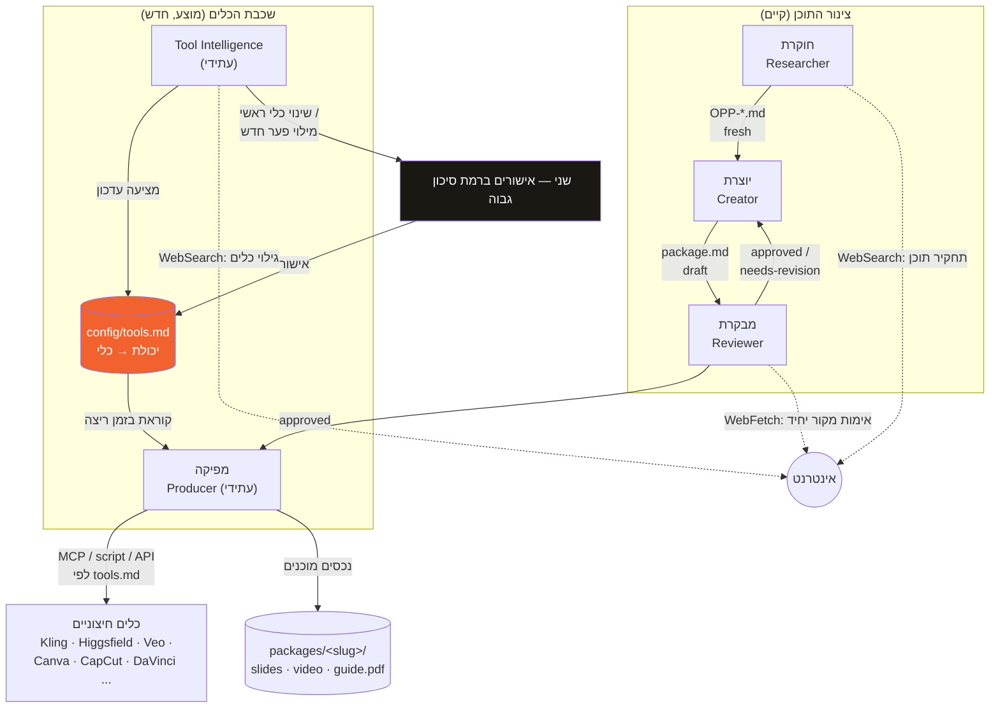

# production-architecture.md — ארכיטקטורת ייצור לטווח ארוך: כלי AI מתחלפים

> מסמך תכנון בלבד. אין קוד, אין סוכנים חדשים, אין שינוי לסוכנים קיימים. תואם
> ARCHITECTURE-organic-marketing-engine.md (במיוחד סעיף 5.3, המפיקה) ומרחיב אותו.
> שאלת המוצא: איך המנוע תומך בכלי AI שמתחלפים כל כמה חודשים (Higgsfield, Kling, Veo, Canva,
> CapCut, DaVinci ואחרים) **בלי לגעת בכל סוכן** בכל פעם שכלי מתחלף?

---

## 0. הפער בארכיטקטורה הקיימת (למה המסמך הזה נחוץ)

ARCHITECTURE §5.3 מגדירה את המפיקה כמי שמריצה **סקריפטים מקומיים בלבד**: `carousels/gen_v6.py`
ו-`content/gen_guide.py`. זה נכון להיום (קרוסלות סטטיות + PDF), אבל לא מכסה את מה שכבר מופיע
בחבילות שהיוצרת כותבת: **ריל עם הדגמת מסך**, ובעתיד ודאי תוכן וידאו/תמונה שדורש כלי AI ייצוריים
חיצוניים. אם ההרחבה הזו תתווסף כמו שהמנוע גדל עד היום — כל כלי חדש = עריכת קוד/פרומפט של המפיקה,
ולפעמים גם של סוכנים אחרים שמזכירים אותו. זו בדיוק ההנחה-שתיכשל שהארכיטקטורה כבר פסלה פעם אחת
(השוו ל-§0 טבלת "מה השתנה מ-v0.1", ממצא #1: "כל שינוי בין סוכנים מאבד הקשר / מורכבות מיותרת").
הפתרון המוצע כאן הוא **אותו עיקרון בדיוק שכבר עובד בשלוש הסוכנות הקיימות**: התנהגות נגזרת מקובץ
config, לא מפרומפט הסוכן. המסמך הזה רק מיישם את זה על "אילו כלים להשתמש", כמו שכבר יושם על "כמה
לחפש" (settings.md) או "איך לדרג" (scoring.md).

**הבחנה קריטית לפני הכול:** יש כאן שני "עולמות תוכן" שונים בשם דומה, ואסור לערבב ביניהם.
- `config/content-pillars.md` עמוד 2 (n8n, Make, Cursor, GitHub, Vercel, **Higgsfield, Kling**) —
  אלה כלים ש**שני משתמשת בהם בעסק שלה**, ולכן מותר לכתוב עליהם תוכן. זה תחום החוקרת/היוצרת.
- קובץ הרישום המוצע במסמך הזה (`config/tools.md`) — אלה כלים ש**המנוע עצמו** משתמש בהם כדי
  **להפיק** את התוכן (וידאו, תמונה, קול, עריכה). זה תחום המפיקה/מודיעין-הכלים.
  ייתכן חפיפה (Higgsfield/Kling יכולים להופיע בשתי הרשימות בו-זמנית, מטעמים שונים לגמרי) — זו
  צירוף מקרים לגיטימי, לא כפילות שצריך לאחד.

---

## 1. עיקרון-העל: יכולת, לא כלי

כל סוכן (חוקרת, יוצרת, מבקרת, ומפיקה בעתיד) מדבר במונחי **יכולת נדרשת** — "וידאו 9:16 מהדגמת מסך
+ תסריט", "הסרת רקע מתמונה", "קריינות בעברית מטקסט" — **לעולם לא** במונחי כלי ספציפי ("תשתמשי
ב-Higgsfield"). התרגום מיכולת לכלי קונקרטי קורה **במקום אחד בלבד**: קובץ רישום כלים
(`config/tools.md`, סעיף 3). זה בדיוק אותו דפוס שכבר קיים במנוע:

| כבר קיים | הדפוס | המקבילה המוצעת כאן |
|---|---|---|
| היוצרת לא יודעת את סף ההפקה (70) — קוראת מ-`settings.md` | פרמטר תפעולי מופרד מלוגיקת הסוכן | המפיקה לא יודעת "Higgsfield" — קוראת מ-`tools.md` |
| החוקרת לא בוחרת בעצמה אילו כלי-סטאק לסרוק — `content-pillars.md` קובע | רשימה סגורה שרק שני עורכת | `tools.md` הוא רשימה סגורה שרק Tool Intelligence מציעה עדכון לה, ושני מאשרת |
| שינוי התנהגות = עריכת config, לא עריכת הסוכנת | הפרדת policy מ-execution | זהה, מיושם על שכבת הכלים |

---

## 2. מי "בעל" בחירת הכלי?

**בחירה (policy) ≠ הפעלה (execution).** שתי אחריויות נפרדות, שני בעלים נפרדים:

- **בעלת הבחירה: סוכן חדש מוצע — Tool Intelligence** (ר' סעיף 4). מעריכה כלים, מציעה עדכון
  ל-`config/tools.md`, **לא מבצעת ייצור בעצמה**. תואם עקרון "המבקרת לא מתקנת בעצמה" ו"החוקרת לא
  בוחרת מה מפיקים" — כל סוכן מציע בתחום שלו, לא מחליט חד-צדדית על תחום של סוכן אחר.
- **בעלת ההפעלה: המפיקה.** קוראת את `tools.md` בזמן ריצה, מפעילה את מה שרשום שם עבור היכולת
  הנדרשת. **אינה יכולה** לבחור כלי אחר ממה שרשום, גם אם היא "חושבת" שכלי אחר עדיף — זה בדיוק
  הגבול שמונע מהמפיקה להפוך למקבלת-החלטות-כלים בפועל.
- **מאשרת סופית: שני.** כל שינוי שמחליף/מוריד כלי ראשי לתפקיד קיים דורש אישור שני (ר' סעיף 5,
  רמות סיכון) — עקבי עם כל שאר המקומות במנוע שבהם שינוי במשמעות ("מה תקין") לא קורה בשקט.

**Producer לא צריך לדעת שמות כלים ספציפיים בפרומפט/בעיצוב שלו.** הפרומפט של המפיקה, כשייכתב,
אמור להגיד "קראי capability→tool מ-`config/tools.md`, הפעילי לפי `invocation` הרשום שם" — לא
"אם הפורמט הוא וידאו, השתמשי ב-X". זה מבטיח שהוספת/החלפת כלי אף פעם לא נוגעת בקובץ הסוכן של המפיקה.

---

## 3. `config/tools.md` — רישום הכלים (מוצע, טרם נוצר)

מבנה מוצע (תואם את הסגנון של `settings.md`/`scoring.md` — טבלה + מוסכמות, שני עורכת חופשי):

```
# tools.md — רישום כלי ייצור

| יכולת | כלי ראשי | שיטת הפעלה | כלי גיבוי | אומת לאחרונה | הערות |
|---|---|---|---|---|---|
| וידאו מטקסט/תסריט | Kling | MCP: kling-connector | Higgsfield | 2026-07-01 | 9:16, עד 35ש' |
| וידאו מהדגמת מסך אמיתית | (הקלטה ידנית — אין כלי) | — | — | — | לא AI-generated, screen capture אמיתי |
| תמונה ממותגת (קרוסלה) | gen_v6.py (סקריפט מקומי) | script | — | 2026-06-01 | לא AI חיצוני — קוד קיים, מוכח |
| הסרת רקע | (טרם נבחר) | — | — | — | פער פתוח |
| קריינות עברית | (טרם נבחר) | — | — | — | פער פתוח |
| עריכת וידאו/הרכבה | CapCut | MCP: capcut-connector | DaVinci | — | ⏳ טרם אומת |
| עיצוב/תבניות (guide, שערי הזדמנות) | Canva | MCP: canva-connector | gen_guide.py | — | ⏳ טרם אומת |

## מוסכמות
- שורה = יכולת אחת, לא כלי אחד. כלי שמכסה כמה יכולות מופיע בכמה שורות.
- "שיטת הפעלה": `MCP: <שם-מחבר>` · `script: <נתיב>` · `API: <תיעוד>` · `manual` (פעולה אנושית,
  לא אוטומציה — למשל הקלטת מסך אמיתית).
- "אומת לאחרונה": תאריך שבו מישהו (Tool Intelligence או שני) בפועל בדק שהכלי/החיבור עדיין עובד.
  שדה ריק = לא אומת מעולם, לא לשימוש בייצור אמיתי בלי אימות ידני קודם.
- שינוי "כלי ראשי" לתפקיד קיים = דורש אישור שני (ר' סעיף 5). הוספת "כלי גיבוי" חדש לתפקיד קיים,
  בלי לגעת בראשי — עדכון-רישום שגרתי, לא דורש אישור (ר' סעיף 5, רמת סיכון נמוכה).
```

זהו הקובץ **היחיד** בכל המנוע שבו מותר לשמות כלים ספציפיים (Higgsfield, Kling, Veo, Canva,
CapCut, DaVinci...) להופיע כ"כלי ייצור". בכל קובץ אחר (פרומפטים של סוכנים, מסמכי תכנון) — רק
מונחי-יכולת.

---

## 4. סוכן Tool Intelligence — כן, נדרש (מוצע, לא נבנה כעת)

**למה לא לוותר עליו ולתת למפיקה לבחור בעצמה:** אז המפיקה חוזרת להיות סוכן שגם מייצר וגם מחליט
"מה הכי טוב היום" — בדיוק הצימוד שהארכיטקטורה כבר פסלה (השוו: היוצרת לא בוחרת הזדמנויות, המבקרת
לא כותבת מחדש). מפיקה שגם מעריכה כלים תצטרך גם כלי חיפוש/MCP-גילוי, מה שהופך אותה מסוכן-הפעלה
צר לסוכן שמנהל גם מחקר-שוק — צימוד תפקידים בדיוק כמו ב-v0.1.

**למה לא לתת לחוקרת לעשות את זה:** תחום שונה לגמרי (כלי ייצור מול הזדמנויות תוכן), קצב שונה
(רבעוני/לפי צורך, לא יומי), קהל יעד שונה של הפלט (config פנימי, לא ledger/inbox של תוכן), וקריטריוני
הערכה שונים לגמרי (איכות רינדור, מחיר, יציבות API — לא "ערך לקהל"). לערבב = לסבך את scoring.md
של החוקרת בקריטריונים שלא שייכים אליה.

**הצעה תמציתית לתפקיד (לא מימוש):**
- **קלט:** `config/tools.md` הקיים, `config/content-pillars.md` עמוד 2 (להימנע מבלבול, לא כמקור
  החלטה), פערים מדווחים מהמפיקה ("אין כלי לתפקיד X" / "הכלי הרשום נכשל N פעמים").
- **עושה:** בודקת אם כלים רשומים עדיין תקינים (API חי? MCP מחובר? מחיר סביר?), מחפשת חלופות
  כשיש פער או כשל חוזר, **משווה על קריטריונים מוגדרים מראש** (איכות פלט לפורמט הרלוונטי, יציבות,
  עלות, זמינות MCP/API), לא "בטעם אישי".
- **פלט:** הצעת עדכון ל-`config/tools.md` (לא עריכה עצמה בשינויי-סיכון-גבוה — ר' סעיף 5) +
  שורת לוג ב-`knowledge/tool-runs.md` (מוצע, מבנה זהה ל-`knowledge/runs.md` הקיים: תאריך, מה
  נבדק, מה הוחלט, מה נכשל).
- **קצב:** לפי דרישה (המפיקה מדווחת על פער/כשל) + סריקה תקופתית יזומה (למשל רבעונית) — לא יומי,
  לא לכל חבילה.
- **אינה סוכנת ייצור.** אינה נוגעת בחבילות, אינה קוראת package.md, אין לה קשר ליוצרת/למבקרת.

---

## 5. רמות סיכון בעדכון הרישום (מי מאשר מה)

| סוג שינוי | דוגמה | מי מאשר |
|---|---|---|
| הוספת כלי גיבוי חדש, בלי לגעת בראשי | "נוסף Runway כגיבוי נוסף לווידאו, ליד Kling הקיים" | Tool Intelligence מעדכנת ישירות, מדווחת בלבד |
| עדכון "אומת לאחרונה" אחרי בדיקה שעברה | "Kling עדיין עובד, נבדק היום" | Tool Intelligence מעדכנת ישירות |
| **החלפת/הסרת כלי ראשי לתפקיד קיים** | "Kling → Veo כברירת מחדל לווידאו" | **שני, חובה** |
| **מילוי פער פתוח לראשונה** (יכולת בלי שום כלי) | "נבחר כלי ראשון להסרת רקע" | **שני, חובה** |
| כלי ראשי נכשל בפועל בייצור (API שבור) | "Higgsfield מחזיר שגיאה 3 ריצות רצוף" | Tool Intelligence עוברת אוטומטית לגיבוי הרשום (אם יש), **מדווחת מיידית** לשני; אם אין גיבוי — עצירת ייצור לתפקיד הזה, לא ניחוש |

ההיגיון תואם את שאר המנוע: שינויים הפיכים וזולים (הוספת אופציה) לא דורשים אישור; שינויים שמשנים
את מה שבפועל יוצא ללקוחות/לפיד (איזה כלי ראשי מייצר את מה שיפורסם) דורשים אישור, בדיוק כמו סף
ההפקה או שינוי ל-brand/voice.md.

---

## 6. מי מותר לו Web Search, מי מותר לו MCP

| סוכן | Web Search | WebFetch | MCP (ייצור: וידאו/תמונה/עיצוב/עריכה) | MCP (כללי: לא-ייצורי) |
|---|---|---|---|---|
| חוקרת (Researcher) | ✅ כן — לתחקיר תוכן, בתקציב מ-settings.md | ✅ כן | ❌ לא — לא בתחומה | Claude in Chrome בימי-דפדפן בלבד (קיים) |
| יוצרת (Creator) | ❌ לא — בכוונה, אוכף "לא ממציאים/לא מאמתים" | ❌ לא | ❌ לא — לא מייצרת נכסים חזותיים | ❌ לא |
| מבקרת (Reviewer) | ❌ לא — לא חוקרת מקורות חדשים | ✅ כן — רק ל-URL המצוטט בחבילה, לאימות | ❌ לא | ❌ לא |
| מפיקה (Producer, עתידי) | ❌ לא — לא בוחרת כלים, רק מפעילה | ⚠️ רק אם כלי-הפעלה ספציפי דורש (למשל בדיקת סטטוס job) | ✅ כן — **זה בדיוק תפקידה**: הפעלת מה שרשום ב-tools.md | ❌ לא |
| Tool Intelligence (עתידי) | ✅ כן — לגילוי/הערכת כלים חדשים | ✅ כן | ⚠️ רק לבדיקת-יכולת/תיעוד (לא ייצור בפועל) | ❌ לא |

**כלל אצבע:** Web Search מוגבל לסוכנים שתפקידם המהותי הוא לגלות משהו חדש בעולם (חוקרת: הזדמנויות
תוכן; Tool Intelligence: כלים). MCP-ייצורי מוגבל לסוכן אחד בלבד — המפיקה — כדי שאם MCP מסוים
נופל/משתנה, נקודת הכשל אחת וברורה, לא מפוזרת.

---

## 7. אילו סוכנים **אף פעם** לא אמורים לדעת שמות כלים ספציפיים

**חוקרת, יוצרת, מבקרת — אף פעם.** הן עובדות ברמת יכולת/תוכן/עובדות, לא ברמת "באיזה API זה נבנה".
גם המנצחת (הסשן הראשי) לא צריכה לדעת — היא מעבירה נתיבים ומצבי-הפעלה, לא בוחרת כלים.

חריג יחיד ומודע: **תוכן על הכלים עצמם** (Higgsfield/Kling כנושא לפוסט, לפי content-pillars.md
עמוד 2) — שם השם **כן** מותר, אבל זה תוכן על הכלי כמוצר בשוק, לא הפעלה שלו. ההבחנה מסעיף 0
חלה כאן במלואה: "לכתוב על X" ו"להפעיל את X כדי לייצר" הם שני דברים נפרדים לחלוטין, גם כששני
הפעולות קשורות לאותו X.

---

## 8. איך זה נשאר ניתן-להרחבה לשנים, לא רק להיום

1. **קובץ יחיד הוא נקודת האמת לכלים** (`tools.md`) — הוספת כלי חדש = שורה חדשה, לא commit לקוד
   סוכן. זה המנגנון המרכזי שעונה על השאלה שנשאלה בהתחלה.
2. **חוזה-יכולת יציב בין המפיקה לרישום**: קלט/פלט מוגדרים ברמת היכולת (למשל "וידאו: קלט
   storyboard+script, פלט קובץ mp4 9:16 + metadata"), לא ברמת פרמטרי API של כלי ספציפי. כלי חדש
   לאותה יכולת = מתאים לאותו חוזה, גם אם ה-API מאחוריו שונה לגמרי. אם כלי חדש **לא** מתאים לחוזה
   הקיים (יכולת קלט/פלט שונה מהותית) — זה עצמו איתות ש-Tool Intelligence צריכה לדווח, לא "לדחוס"
   כלי לחוזה שלא מתאים לו.
3. **שרשרת גיבוי מוגדרת מראש** לכל יכולת קריטית — כלי ראשי שנופל לא עוצר ייצור, עובר לגיבוי
   הרשום ומדווח (סעיף 5), לא מאלתר.
4. **לוג היסטוריה** (`knowledge/tool-runs.md` המוצע) — כל שינוי כלי מתועד עם תאריך וסיבה, בדיוק
   כמו `knowledge/runs.md` הקיים לחוקרת. מאפשר לענות "למה עברנו מ-X ל-Y" בעוד שנה, לא רק היום.
5. **הפרדת אחריות קבועה**: מי שמעריך כלים (Tool Intelligence) אף פעם לא מייצר בעצמו; מי שמייצר
   (המפיקה) אף פעם לא בוחר כלי בעצמו. הצימוד הזה הוא בדיוק מה שהיה שובר את המנוע הזה בעוד שנתיים,
   כמו שכבר שבר את v0.1 עם 7 סוכנים מצומדים מדי.
6. **תוקף/אימות מפורש**: שדה "אומת לאחרונה" מונע מצב שקט של "הרישום אומר X אבל X כבר לא עובד
   חודשים" — כשל גלוי, לא הנחת-יסוד שקטה (עקבי עם "אין ברירת מחדל שקטה" שכבר נוהג בכל שלושת
   הסוכנים הקיימים).

---

## 9. תרשים ארכיטקטורה מומלץ



**קריאת התרשים:** צינור התוכן (חוקרת→יוצרת→מבקרת) לא נוגע בשכבת הכלים בכלל — אין חץ ביניהם.
המפיקה היא נקודת המפגש היחידה בין השתיים. `config/tools.md` הוא הצומת המרכזי: Tool Intelligence
כותבת אליו (עם אישור שני לשינויים מהותיים), המפיקה קוראת ממנו. שום סוכן אחר לא נוגע בו.

---

## 10. תוכנית הגירה (Migration Plan)

**שלב 0 — עכשיו (הושלם):** חוקרת, יוצרת, מבקרת בנויות ועובדות. המפיקה עדיין לא קיימת. אין עדיין
צורך דחוף בשכבת הכלים כי שום סוכן לא מייצר נכסים חיצוניים עדיין.

**שלב 1 — בניית `config/tools.md` (לפני המפיקה, לא אחריה):**
1. שני ממלאת שורה ראשונה לכל יכולת שכבר ידועה כנחוצה מהחבילה הקיימת (וידאו הדגמת-מסך, לפחות).
2. סימון מפורש של פערים פתוחים (קריינות עברית, הסרת רקע וכו') כ"טרם נבחר" — לא ריק סתם.
3. הקובץ נוצר **גם אם ריק ברובו** — זה עדיין עדיף על היעדרו, כי הוא קובע את הצורה שהמפיקה תכתוב
   נגדה.

**שלב 2 — בניית המפיקה (V1, סקריפטים מקומיים בלבד, תואם ARCHITECTURE §5.3 הקיים):**
4. המפיקה נבנית ראשונה מול היכולות שכבר יש להן כלי רשום ופשוט (`gen_v6.py`, `gen_guide.py`) —
   ערך מיידי, סיכון נמוך, בלי תלות בכלים חיצוניים חדשים.
5. עיצוב הפרומפט של המפיקה **מההתחלה** סביב "קראי capability מ-package.md → חפשי ב-tools.md →
   הפעילי" — גם אם כרגע רוב היכולות מצביעות על סקריפט מקומי בלבד. זה מונע Refactor כואב מאוחר יותר.

**שלב 3 — הרחבה לכלי AI חיצוניים (רק כשיש MCP מחובר בפועל):**
6. לכל יכולת עם MCP זמין (למשל וידאו) — שני מאשרת כלי ראשי ראשון ל-`tools.md` (שינוי "מילוי פער
   פתוח לראשונה", סעיף 5), נבדק ידנית פעם אחת מול חבילה אמיתית לפני שהמפיקה תסתמך עליו אוטומטית.
7. המפיקה **לא** משתנה בקוד/בפרומפט שלה בשלב הזה — רק `tools.md` מתעדכן. זה מבחן-הקבלה האמיתי
   לארכיטקטורה הזו: אם השלב הזה דורש עריכת המפיקה, המודל נכשל וצריך לתקן את סעיף 3 לפני שממשיכים.

**שלב 4 — הקמת Tool Intelligence (רק כשיש יותר מכלי אחד-שניים לתחזק):**
8. כל עוד יש כלי-או-שניים בסך הכול, שני יכולה לתחזק את `tools.md` ידנית בלי סוכן ייעודי —
   אין טעם לבנות סוכן לבעיה שעוד לא קיימת (עקרון "value-first" שכבר נוהג בסדר הבנייה של
   ARCHITECTURE §8: יוצרת→מפיקה→מבקרת→חוקרת, לפי ערך מיידי, לא לפי "שלמות תיאורטית").
9. טריגר טבעי להקמתה: יותר מ-2–3 יכולות עם יותר מכלי אחד רלוונטי כל אחת, או כלי ראשי שנכשל
   פעמיים+ בלי שנבדק מחדש — כלומר כשהתחזוקה הידנית הופכת לנטל אמיתי, לא מראש.

**שלב 5 — תחזוקה שוטפת:**
10. Tool Intelligence (או שני, אם עדיין ידני) עוברת על `tools.md` בקצב שנקבע (מוצע: רבעוני)
    ומעדכנת "אומת לאחרונה"; המפיקה מדווחת כשל בפועל מיידית, לא ממתינה לסבב הבא.

**מדד הצלחה לכל השלב הזה:** הוספת כלי AI חדש (למשל Veo מחליף את Kling) לא נוגעת באף קובץ מתחת
ל-`.claude/agents/` וגם לא בקוד/פרומפט המפיקה — רק שורה ב-`config/tools.md`. זה בדיוק המבחן
שהמשימה המקורית ביקשה.
